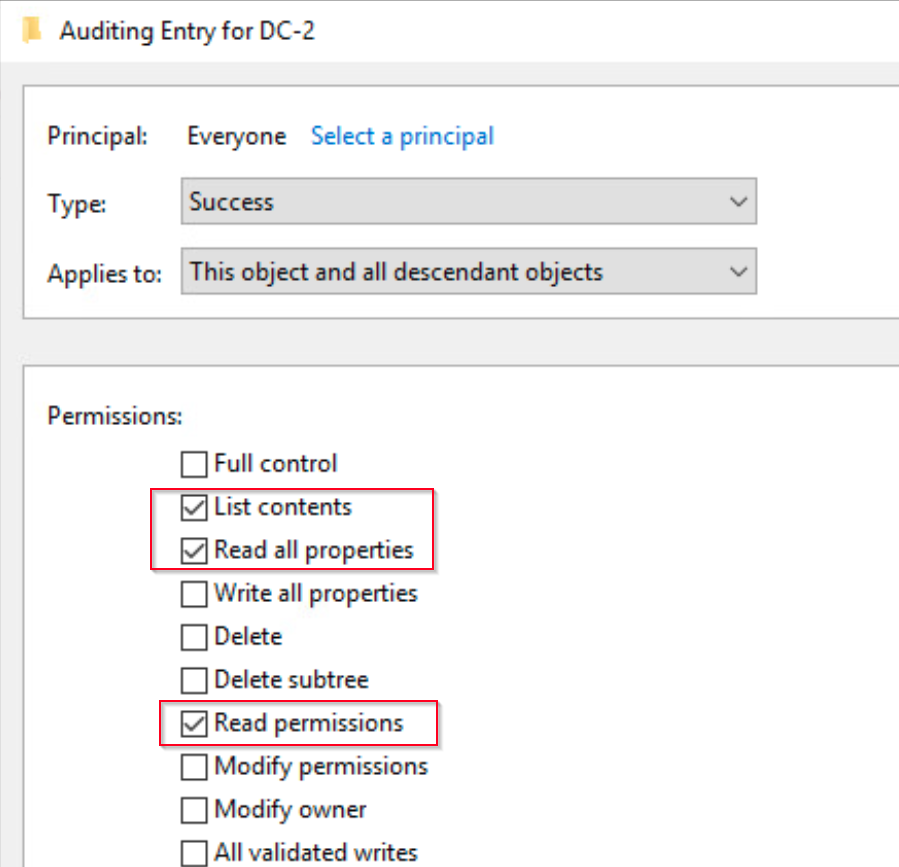

# 13. Active Directory Enumeration

## Chapter Goal

This chapter explains how attackers enumerate Active Directory and how defenders can detect that enumeration.

The main focus is:

```text
Active Directory enumeration
LDAP
ADSI
PowerShell DirectorySearcher
PowerView
BloodHound concept
Directory Service Access auditing
Security Event ID 4662
Baseline monitoring
Unexpected access detection
Honey tokens
```

Important defender idea:

```text
Active Directory is designed to be readable by domain users.

That is useful for administration,
but it also gives attackers a lot of information during reconnaissance.
```

---

# 13.1. Abusing Lightweight Directory Access Protocol

## What Is Active Directory?

Active Directory, or AD, is a Microsoft directory service.

It stores objects such as:

```text
users
groups
computers
organizational units
domain controllers
service accounts
permissions
group memberships
```

Simple meaning:

```text
Active Directory is like a central database for domain users, computers, and permissions.
```

Attackers like Active Directory because it can reveal:

```text
who the admins are
where domain controllers are
which users exist
which groups are privileged
which computers exist
which accounts may be useful for lateral movement
```

---

## Why Active Directory Enumeration Matters

By default, normal domain users can read a lot of Active Directory information.

This means:

```text
An attacker does not always need administrator rights to enumerate AD.
```

A low-privileged domain user may still be able to query:

```text
domain controllers
domain users
domain groups
group membership
computer objects
service accounts
organizational structure
```

This is why defenders must monitor enumeration activity.

---

# 13.1.1. Understanding LDAP

## What Is LDAP?

LDAP stands for:

```text
Lightweight Directory Access Protocol
```

LDAP is the main protocol used to query and interact with directory services like Active Directory.

Simple meaning:

```text
LDAP is the language used to ask Active Directory questions.
```

Example questions:

```text
Who are the domain admins?
Which computers are in the domain?
Where is the domain controller?
Which users have "admin" in the name?
```

---

## LDAP Client-Server Model

LDAP works using a client-server model.

```text
LDAP client  → sends request
LDAP server  → processes request
Directory service → stores and returns data
```

Simple flow:

```text
Client sends LDAP query
→ LDAP server receives it
→ Active Directory processes it
→ result is returned to the client
```

---

## LDAP Client

The LDAP client is the component that makes the request.

Examples of LDAP clients:

```text
PowerShell script
DirectorySearcher object
PowerView
BloodHound collector
admin tool
custom application
```

Simple meaning:

```text
LDAP client = the system or tool asking Active Directory for information.
```

---

## LDAP Server

The LDAP server is the component that receives and processes requests.

In an Active Directory environment, this is usually the:

```text
Domain Controller
```

Simple meaning:

```text
LDAP server = the domain controller answering LDAP queries.
```

---

## Common LDAP Operations

LDAP operations include:

```text
bind
search
modify
delete
add
compare
```

Most enumeration uses:

```text
search
```

Simple meaning:

```text
Attackers mostly use LDAP search operations to read AD information.
```

---

# 13.1.2. Interacting with LDAP

## What Is ADSI?

ADSI means:

```text
Active Directory Service Interfaces
```

ADSI is a Microsoft interface that allows programs and scripts to interact with directory services.

Simple meaning:

```text
ADSI is a Windows way to talk to Active Directory.
```

PowerShell can use ADSI through .NET classes such as:

```text
System.DirectoryServices.DirectorySearcher
System.DirectoryServices.DirectoryEntry
```

---

## What Is DirectorySearcher?

`DirectorySearcher` is a .NET class that can be used from PowerShell to query Active Directory.

PowerShell example:

```powershell
$Searcher = New-Object System.DirectoryServices.DirectorySearcher
```

Simple meaning:

```text
DirectorySearcher creates an LDAP search object.
```

---

## Default DirectorySearcher Filter

By default, DirectorySearcher uses:

```text
(objectClass=*)
```

Meaning:

```text
Return all objects.
```

Important:

```text
This can create a lot of LDAP activity and log noise.
```

From a defender perspective:

```text
Broad LDAP queries can be suspicious.
```

---

## Distinguished Name

In LDAP, a Distinguished Name, or DN, is the full path to an object.

Example:

```text
CN=DC-2,OU=Domain Controllers,DC=corp,DC=com
```

Meaning:

```text
CN=DC-2
```

is the common name of the object.

```text
OU=Domain Controllers
```

is the organizational unit.

```text
DC=corp,DC=com
```

is the domain.

Simple meaning:

```text
The distinguishedName is the full LDAP path to an object.
```

---

## Query a Specific AD Object with PowerShell

Example:

```powershell
$Searcher = New-Object System.DirectoryServices.DirectorySearcher

$Searcher.Filter = '(distinguishedName=CN=DC-2,OU=Domain Controllers,DC=corp,DC=com)'

$Searcher.FindOne()
```

Explanation:

```text
Create a DirectorySearcher object
→ Set LDAP filter
→ Search for one matching object
```

---

## FindOne vs FindAll

```powershell
$Searcher.FindOne()
```

Meaning:

```text
Return one result.
```

```powershell
$Searcher.FindAll()
```

Meaning:

```text
Return all matching results.
```

Example:

```powershell
$Searcher.FindAll()
```

---

## LDAP Query as Another User

Sometimes a query is executed using another user's credentials.

Example:

```powershell
$Searcher = New-Object System.DirectoryServices.DirectorySearcher

$Searcher.SearchRoot = New-Object System.DirectoryServices.DirectoryEntry(
    "LDAP://DC=corp,DC=com",
    'corp\Danilo',
    'Qwerty09!'
)

$Searcher.Filter = '(&(objectClass=computer)(cn=*dc*))'

$Searcher.FindAll()
```

Explanation:

```text
DirectoryEntry defines the LDAP root and credentials.
DirectorySearcher uses that SearchRoot.
The filter searches for computer objects with "dc" in the common name.
```

---

## LDAP Filter Examples

Find all objects:

```text
(objectClass=*)
```

Find computers:

```text
(objectClass=computer)
```

Find users:

```text
(objectClass=user)
```

Find users with admin in the common name:

```text
(&(objectClass=user)(cn=*admin*))
```

Find computers with dc in the name:

```text
(&(objectClass=computer)(cn=*dc*))
```

Find a specific distinguished name:

```text
(distinguishedName=CN=DC-2,OU=Domain Controllers,DC=corp,DC=com)
```

---

## Important Defender Note

LDAP queries do not require administrative rights.

A standard domain user can usually query Active Directory.

Important:

```text
Low privilege does not mean low visibility.
```

Attackers can enumerate AD with normal user access.

---

# 13.1.3. Enumerating Active Directory with PowerView

## What Is PowerView?

PowerView is a PowerShell-based Active Directory enumeration tool.

It is commonly used after an attacker obtains a foothold in a domain environment.

Simple meaning:

```text
PowerView helps attackers ask many useful Active Directory questions.
```

PowerView is part of the PowerSploit(https://github.com/PowerShellMafia/PowerSploit) framework inside the Recon which Contains many offensive PowerShell modules. 


PowerView can enumerate:

```text
domain controllers
domain users
domain groups
group members
sessions
shares
trusts
ACLs
computers
local admin access
```

It shouild be noted that PowerView (or basically PowerSploit) is quite old and its github repo is not maintained anymore. Therefore, there are more new and advanced altenratives for the same or evern more sophisticated enumeration:

```text

Modern substitutes are:

BloodHound / SharpHound:
best for AD attack-path analysis.

BloodHound CE:
modern BloodHound direction.

NetExec:
great from Kali for SMB/LDAP/WinRM enumeration.

Impacket:
great Linux-based AD and Kerberos toolkit.

SOAPHound:
newer ADWS-based AD collection.

AD Miner:
good for blue-team AD audit reporting.

Invoke-ADEnum:
PowerShell-based AD enumeration/auditing alternative.
```


---

## Loading PowerView

Attackers may bypass PowerShell execution policy and load the script.

Example:

```powershell
powershell -exec bypass
```

Then:

```powershell
. .\PowerView.ps1
```

The dot-space syntax means:

```text
Load the PowerView functions into the current PowerShell session.
```

---

## Enumerate Domain Controllers

PowerView command:

```powershell
Get-NetDomainController
```

This can reveal:

```text
domain name
domain controller name
IP address
operating system version
site name
roles
partitions
```

Example important output:

```text
Forest: corp.com
Domain: corp.com
Name: DC01.corp.com
IPAddress: 192.168.51.128
OSVersion: Windows Server 2019 Standard
```

Defender idea:

```text
A normal user suddenly enumerating domain controllers may be suspicious.
```

---

## Enumerate Domain Admins

PowerView command:

```powershell
Get-NetGroupMember -Identity 'Domain Admins'
```

This can reveal:

```text
group name
group distinguished name
member name
member distinguished name
member SID
member object class
```

Example:

```text
GroupName: Domain Admins
MemberName: dadmin
MemberDistinguishedName: CN=dadmin,OU=Staff,DC=corp,DC=com
```

Why this matters:

```text
Attackers want to know which accounts are highly privileged.
```

---

## BloodHound Concept

BloodHound is another Active Directory enumeration and attack path analysis tool.

It collects AD data and builds graphs showing possible attack paths.

Simple meaning:

```text
BloodHound shows how an attacker may move from a low-privileged account to high-value targets.
```

BloodHound collectors often gather:

```text
users
groups
sessions
ACLs
local admin rights
domain trusts
group memberships
computer relationships
```

Defender note:

```text
BloodHound-style collection can be noisy and detectable.
```

---

# 13.2. Detecting Active Directory Enumeration

## Detection Goal

The goal is to detect when users or tools access sensitive Active Directory objects.

This chapter focuses on:

```text
Directory Service Access auditing
Security Event ID 4662
Baseline monitoring
Honey tokens
```

---

# 13.2.1. Auditing Object Access

## What Is an Audit Policy?

An audit policy controls what Windows records in the event logs.

Simple meaning:

```text
Audit policy decides which actions generate logs.
```

For Active Directory enumeration, the relevant audit category is:

```text
DS Access
```

The important subcategory is:

```text
Directory Service Access
```

---

## auditpol

`auditpol` is a Windows command-line tool used to view and configure audit policies.

List audit categories:

```powershell
auditpol /list /category
```

Example categories:

```text
Account Logon
Account Management
Detailed Tracking
DS Access
Logon/Logoff
Object Access
Policy Change
Privilege Use
System
```

List all subcategories:

```powershell
auditpol /list /subcategory:*
```

Check Directory Service Access setting:

```powershell
auditpol /get /subcategory:"Directory Service Access"
```

Expected example:

```text
DS Access
  Directory Service Access                Success
```

Meaning:

```text
Successful directory service access events are being audited.
```

---

## Security Event ID 4662

Important event:

```text
Security Event ID 4662
```

Meaning:

```text
An operation was performed on an object.
```

In Active Directory monitoring, this can show:

```text
which user accessed an AD object
which object was accessed
what type of access happened
which operation was performed
```

---

## Why Event ID 4662 Matters

If auditing is configured correctly on an AD object, Event ID 4662 can show when someone reads or accesses that object.

Example:

```text
offsec read a property from the DC-2 computer object.
```

Useful fields:

```text
SubjectUserSid
SubjectUserName
ObjectName
ObjectType
OperationType
AccessMask
Properties
```

---

## Configuring Object Auditing in ADUC (Active Directory Users and Computers)

To configure object auditing:

```text
Open Active Directory Users and Computers (dsa.msc)
→ Navigate to the object
→ Right-click object (uch as users, groups, computers, and OUs)
→ Properties
→ Security
→ Advanced
→ Auditing
→ Add
```

Then configure:

```text
Principal
Type
Access
Applies To
```

---

## Important Audit Entry Elements

| Element | Meaning |
|---|---|
| Principal | Which identity is audited |
| Type | Success, Failure, or both |
| Access | Which permissions/actions are audited |
| Inherited From | Whether audit entry was inherited |
| Applies To | Whether it applies to this object, descendants, or both |

---

## Principal

The principal is the account or group being audited.

For broad monitoring, use:

```text
Everyone
```

Meaning:

```text
Audit access from all possible accounts.
```

---

## Audit Type

For enumeration detection, choose:

```text
Success
```

Meaning:

```text
Generate an event when the access succeeds.
```

---

## Important Audit Permissions

To audit directory service access, enable these three permission elements:

```text
List contents
Read all properties
Read permissions
```



Simple meaning:

```text
Generate logs when someone lists or reads the object or its properties.
```

---

## Object GUIDs and SIDs

In Event Viewer General view, Windows may show friendly names.

But in XML/details view, values often appear as:

```text
SID
GUID
AccessMask
```

Example SID:

```text
S-1-5-21-2154860315-1826001137-329834519-1107
```

Example object GUID format in logs:

```text
%{0ca1d341-b9ee-4d46-ab3b-3a2732aa4b51}
```

Important:

```text
The scripts in this chapter use these SID and GUID values for filtering.
```

---

# 13.2.2. Baseline Monitoring

## What Is Baseline Monitoring?

Baseline monitoring means defining what normal activity looks like.

Then anything outside that normal behavior becomes suspicious.

Simple meaning:

```text
Expected access = normal
Unexpected access = investigate
```

Example:

```text
Adrian is expected to read Domain Admins.
Danilo is not expected to read Domain Admins.
```

If `Danilo` accesses the Domain Admins group:

```text
This is anomalous and should be investigated.
```

---

## Why Baseline Monitoring Helps

Attackers often enumerate high-value objects such as:

```text
Domain Admins
Enterprise Admins
Domain Controllers
Privileged service accounts
Admin groups
Sensitive OUs
```

If we know which accounts normally access these objects, we can detect unusual access.

---

## Weakness of Baseline Monitoring

Baseline monitoring can be difficult because:

```text
large environments generate many events
normal behavior changes over time
baselines must be updated
too many false positives may appear
authorized accounts can still be compromised
```

Important:

```text
Baseline monitoring is powerful but maintenance-heavy.
```

---

# XPath Filtering with Get-WinEvent

## What Is XPath Filtering?

XPath is a query language used to select parts of XML.

Windows Event Logs can be queried with XPath because event details are stored as XML.

Simple meaning:

```text
XPath lets us filter Windows events very precisely.
```

Instead of manually searching Event Viewer, we can filter:

```text
Event ID
SubjectUserSid
ObjectName
OperationType
```

---

## Basic Get-WinEvent with XML Filter

Example concept:

```powershell
Get-WinEvent -FilterXml $FilterXML
```

This means:

```text
Use the XML query stored in $FilterXML to search the event log.
```

the XML query inside $FilterXML uses XPath-style filtering to search Windows Event Logs. So basically -FilterXml lets us search Event Logs using an XML query.
Inside that XML query, the <Select> and <Suppress> sections use XPath expressions.

---

# Script 1: Baseline Expected Access

## Purpose

This script finds expected access events.

In this example:

```text
Expected user SID accesses the Domain Admins group.
```

It searches for:

```text
Security Event ID 4662
SubjectUserSid = expected user
ObjectName = Domain Admins GUID
OperationType = Object Access
```

The script also translates:

```text
GUID → friendly object name
AccessMask → friendly access name
```

---

## Baseline Expected PowerShell Script

```powershell
Function Get-GuidName ($Guid) {
    Begin {
        $ObjectTable = @{
            '%{0ca1d341-b9ee-4d46-ab3b-3a2732aa4b51}' = 'Domain Admins'
        }
    }
    Process {
        $Value = $ObjectTable[$Guid]
        If (!$Value) {
            $Value = $Guid
        }
    }
    End {
        return $Value
    }
}

Function Get-AccessName ($AccessMask) {
    Begin {
        $AccessTable = @{
            '0x10' = 'Read Property'
            '0x20000' = 'READ_CONTROL'
        }
    }
    Process {
        $Value = $AccessTable[$AccessMask]
        If (!$Value) {
            $Value = $AccessMask
        }
    }
    End {
        return $Value
    }
}

$FilterXML = @'
<QueryList>
  <Query Id="0" Path="Security">
    <Select Path="Security">
     *[System[(EventID=4662)]] 
     and 
     *[EventData[(Data[@Name='SubjectUserSid']='S-1-5-21-2154860315-1826001137-329834519-1107')]]
     and
     *[EventData[(Data[@Name='ObjectName']='%{0ca1d341-b9ee-4d46-ab3b-3a2732aa4b51}')]]
     and
     *[EventData[(Data[@Name='OperationType']='Object Access')]]
   </Select>
  </Query>
</QueryList>
'@

$Logs = Get-WinEvent -FilterXml $FilterXML
ForEach ($L in $Logs) {
   [xml]$XML = $L.toXml()
   $TimeStamp = $XML.Event.System.TimeCreated.SystemTime
   $SubjectUserName = $XML.Event.EventData.Data[1].'#text'
   $ObjectName = Get-GuidName $($XML.Event.EventData.Data[6].'#text')
   $AccessMask = Get-AccessName $($XML.Event.EventData.Data[10].'#text')
   [PSCustomObject]@{
      'TimeStamp' = $TimeStamp
      'SubjectUserName' = $SubjectUserName
      'ObjectName' = $ObjectName
      'AccessMask' = $AccessMask
   }
}
```

---

## Script 1 Output Meaning

Example output:

```text
TimeStamp                         SubjectUserName ObjectName     AccessMask
---------                         --------------- ----------     ----------
2022-01-19T16:24:04.312607600Z    offsec          Domain Admins  Read Property
```

Meaning:

```text
The expected account accessed the Domain Admins object.
```

---

# Script 2: Baseline Unexpected Access

## Purpose

This script finds unexpected access to the same sensitive object.

It searches for:

```text
Security Event ID 4662
ObjectName = Domain Admins GUID
OperationType = Object Access
```

But it suppresses the known expected user SID.

Meaning:

```text
Show everyone who accessed Domain Admins except the expected account.
```

This is useful for finding suspicious enumeration.

---

## Important Concept: Suppress

The XML query uses:

```xml
<Suppress>
```

Meaning:

```text
Exclude matching events.
```

In this case, the script excludes the expected user SID:

```text
S-1-5-21-2154860315-1826001137-329834519-1107
```

So any remaining results are unexpected.

---

## Baseline Unexpected PowerShell Script

```powershell
Function Get-GuidName ($Guid) {
    Begin {
        $ObjectTable = @{
            '%{0ca1d341-b9ee-4d46-ab3b-3a2732aa4b51}' = 'Domain Admins'
        }
    }
    Process {
        $Value = $ObjectTable[$Guid]
        If (!$Value) {
            $Value = $Guid
        }
    }
    End {
        return $Value
    }
}

Function Get-AccessName ($AccessMask) {
    Begin {
        $AccessTable = @{
            '0x10' = 'Read Property'
            '0x20000' = 'READ_CONTROL'
        }
    }
    Process {
        $Value = $AccessTable[$AccessMask]
        If (!$Value) {
            $Value = $AccessMask
        }
    }
    End {
        return $Value
    }
}

$FilterXML = @'
<QueryList>
  <Query Id="0" Path="Security">
    <Select Path="Security">
     *[System[(EventID=4662)]]
     and
     *[EventData[(Data[@Name='ObjectName']='%{0ca1d341-b9ee-4d46-ab3b-3a2732aa4b51}')]]
     and
     *[EventData[(Data[@Name='OperationType']='Object Access')]]
   </Select>
   <Suppress Path="Security">
    *[EventData[(Data[@Name='SubjectUserSid']='S-1-5-21-2154860315-1826001137-329834519-1107')]]
   </Suppress>
  </Query>
</QueryList>
'@

$Logs = Get-WinEvent -FilterXml $FilterXML
ForEach ($L in $Logs) {
   [xml]$XML = $L.toXml()
   $TimeStamp = $XML.Event.System.TimeCreated.SystemTime
   $SubjectUserName = $XML.Event.EventData.Data[1].'#text'
   $ObjectName = Get-GuidName $($XML.Event.EventData.Data[6].'#text')
   $AccessMask = Get-AccessName $($XML.Event.EventData.Data[10].'#text')
   [PSCustomObject]@{
      'TimeStamp' = $TimeStamp
      'SubjectUserName' = $SubjectUserName
      'ObjectName' = $ObjectName
      'AccessMask' = $AccessMask
   }
}
```

---

## Script 2 Output Meaning

Example output:

```text
TimeStamp                         SubjectUserName ObjectName     AccessMask
---------                         --------------- ----------     ----------
2022-01-19T15:53:37.890100300Z    Danilo            Domain Admins  Read Property
```

Meaning:

```text
Danilo accessed the Domain Admins group,
but Danilo  was not part of the expected baseline.
```

Defender conclusion:

```text
Investigate Danilo's activity.
```

---

# 13.2.3. Using Honey Tokens

## What Are Honey Tokens?

Honey tokens are fake or decoy objects created to detect attacker activity.

They are similar to honeypots, but inside the directory.

Examples:

```text
fake user
fake computer
fake service account
fake privileged group
fake distribution group
```

Simple meaning:

```text
Honey tokens are traps.
```

If someone accesses them:

```text
That access is suspicious.
```

---

## Why Honey Tokens Work

Normally, honey token objects should not be used or queried.

So if they appear in object access logs:

```text
someone may be enumerating Active Directory.
```

This is useful because it creates less noise than baseline monitoring.

Important:

```text
Any access to honey tokens should be treated as suspicious.
```

---

## Example Honey Token Objects

Example objects from this chapter:

| Object Type | Name |
|---|---|
| Computer | HoneySrv01 |
| Computer | HoneyPC01 |
| User | HoneyUser01 |
| User | HoneySvc01 |
| Group | HoneySecGroup01 |
| Group | HoneyDistGroup01 |

Important real-world note:

```text
Do not use obvious names like HoneyUser01 in production.
```

Better approach:

```text
Use names that match the organization's naming convention.
```

Example:

```text
svc-backup-prod
adm-sql-maint
WS-FIN-042
SRV-HR-LEGACY01
```

---

# Script 3: Honey Token Detection

## Purpose

This script detects access to honey token objects.

It searches for:

```text
Security Event ID 4662
OperationType = Object Access
ObjectName = one of the honey token GUIDs
```

If any user accesses these objects:

```text
Alert and investigate.
```

---

## Honey Token PowerShell Script

```powershell
Function Get-GuidName ($Guid) {
    Begin {
        $ObjectTable = @{
            '%{a11236c4-e6ae-4dc7-ad58-92b6b6b5f83d}' = 'HoneySrv01'
            '%{a1a88fa6-e570-4520-9b21-6bad8483979b}' = 'HoneyPC01'
            '%{6e1648e7-b100-4bdf-b497-7061e8d7a068}' = 'HoneyUser01'
            '%{74215987-5fa5-4e36-b4d2-c9fdc5fca747}' = 'HoneySvc01'
            '%{c2e86461-de97-4ef5-881c-e6ccfb97df5d}' = 'HoneySecGroup01'
            '%{02f71039-cf2c-47a8-aeeb-ff257851f149}' = 'HoneyDistGroup01'
        }
    }
    Process {
        $Value = $ObjectTable[$Guid]
        If (!$Value) {
            $Value = $Guid
        }
    }
    End {
        return $Value
    }
}

Function Get-AccessName ($AccessMask) {
    Begin {
        $AccessTable = @{
            '0x10' = 'Read Property'
            '0x20000' = 'READ_CONTROL'
        }
    }
    Process {
        $Value = $AccessTable[$AccessMask]
        If (!$Value) {
            $Value = $AccessMask
        }
    }
    End {
        return $Value
    }
}

$FilterXML = @'
<QueryList>
  <Query Id="0" Path="Security">
    <Select Path="Security">
     *[System[(EventID=4662)]] 
     and 
     *[EventData[(Data[@Name='OperationType']='Object Access')]]
     and
     *[EventData[Data[@Name='ObjectName'] and (Data='%{02f71039-cf2c-47a8-aeeb-ff257851f149}' or 
     Data='%{a1a88fa6-e570-4520-9b21-6bad8483979b}' or Data='%{6e1648e7-b100-4bdf-b497-7061e8d7a068}' or
     Data='%{74215987-5fa5-4e36-b4d2-c9fdc5fca747}' or Data='%{c2e86461-de97-4ef5-881c-e6ccfb97df5d}' or
     Data='%{02f71039-cf2c-47a8-aeeb-ff257851f149}')]]
   </Select>
  </Query>
</QueryList>
'@

$Logs = Get-WinEvent -FilterXml $FilterXML
ForEach ($L in $Logs) {
   [xml]$XML = $L.toXml()
   $TimeStamp = $XML.Event.System.TimeCreated.SystemTime
   $SubjectUserName = $XML.Event.EventData.Data[1].'#text'
   $ObjectName = Get-GuidName $($XML.Event.EventData.Data[6].'#text')
   $AccessMask = Get-AccessName $($XML.Event.EventData.Data[10].'#text')
   [PSCustomObject]@{
      'TimeStamp' = $TimeStamp
      'SubjectUserName' = $SubjectUserName
      'ObjectName' = $ObjectName
      'AccessMask' = $AccessMask
   }
}
```

---

## Script 3 Output Meaning

Example:

```text
TimeStamp                         SubjectUserName ObjectName   AccessMask
---------                         --------------- ----------   ----------
2022-01-19T19:19:09.156667000Z    Danilo            HoneyPC01    Read Property
2022-01-19T19:19:09.156616400Z    Danilo            HoneySrv01   Read Property
```

Meaning:

```text
Danilo accessed honey token objects.
```

Defender conclusion:

```text
This is suspicious and should be investigated.
```

---

# Important Event Fields in These Scripts

## TimeStamp

Extracted from:

```powershell
$XML.Event.System.TimeCreated.SystemTime
```

Meaning:

```text
When the event happened.
```

---

## SubjectUserName

Extracted from:

```powershell
$XML.Event.EventData.Data[1].'#text'
```

Meaning:

```text
The account that accessed the object.
```

---

## ObjectName

Extracted from:

```powershell
$XML.Event.EventData.Data[6].'#text'
```

Meaning:

```text
The GUID of the AD object that was accessed.
```

The script translates GUIDs into friendly names using:

```powershell
Get-GuidName
```

---

## AccessMask

Extracted from:

```powershell
$XML.Event.EventData.Data[10].'#text'
```

Meaning:

```text
The type of access that happened.
```

Examples:

```text
0x10    = Read Property
0x20000 = READ_CONTROL
```

The script translates access masks using:

```powershell
Get-AccessName
```

---

# Why the Scripts Use Hash Tables

The scripts include helper functions like:

```powershell
Get-GuidName
Get-AccessName
```

These use hash tables to translate raw values.

Example:

```powershell
$ObjectTable = @{
    '%{0ca1d341-b9ee-4d46-ab3b-3a2732aa4b51}' = 'Domain Admins'
}
```

Meaning:

```text
If this GUID appears, display "Domain Admins".
```

Why not perform LDAP lookup dynamically?

```text
Because LDAP lookup itself may generate more audit events.
```

So the script avoids extra noise by using known GUID mappings.

---

# Important: Replace Lab-Specific Values

The SIDs and GUIDs in these scripts are lab-specific.

In a real environment, replace:

```text
SubjectUserSid
ObjectName GUIDs
ObjectTable entries
Honey token GUIDs
```

with values from your own Active Directory.

You can find object values in ADUC:

```text
Active Directory Users and Computers
→ View
→ Advanced Features
→ Object Properties
→ Attribute Editor
```

Useful attributes:

```text
objectSid
objectGUID
distinguishedName
cn
```

---

# Detection Strategy 1: Baseline Monitoring

## Basic Idea

```text
Monitor sensitive AD objects.
Allow expected users.
Alert on unexpected users.
```

Example:

```text
Expected:
dadmin reads Domain Admins.

Unexpected:
Danilo reads Domain Admins.
```

---

## Good Objects for Baseline Monitoring

Monitor objects such as:

```text
Domain Admins
Enterprise Admins
Administrators
Domain Controllers OU
Privileged service accounts
Tier 0 admin groups
Backup operator groups
GPO admin groups
Sensitive delegation groups
```

---

## Pros

```text
Can detect suspicious access to important AD objects.
Useful for high-value groups.
Good for controlled environments.
```

---

## Cons

```text
Can be noisy.
Requires good documentation.
Requires continuous tuning.
May miss attacks using an expected account.
Harder in large environments.
```

---

# Detection Strategy 2: Honey Tokens

## Basic Idea

```text
Create decoy AD objects.
No one should touch them.
Alert if anyone accesses them.
```

Example:

```text
HoneySvc01 is a fake service account.
If someone queries it, that may indicate enumeration.
```

---

## Good Honey Token Ideas

Possible honey token objects:

```text
fake admin-looking user
fake service account
fake computer account
fake security group
fake file share group
fake legacy server object
fake privileged OU
```

Better names should look realistic.

Examples:

```text
svc-sql-backup
adm-legacy-sync
SRV-FIN-OLD01
WS-HR-042
SQL-Backup-Operators
```

---

## Pros

```text
Lower noise.
High-confidence alerts.
Easier to implement than full baseline monitoring.
Good for detecting broad enumeration.
```

---

## Cons

```text
Requires careful naming.
Advanced attackers may avoid obvious honey objects.
Must ensure legitimate tools do not query them regularly.
Needs documentation and alerting process.
```

---

# Defender Investigation Workflow

## Step 1: Confirm Audit Policy

Run:

```powershell
auditpol /get /subcategory:"Directory Service Access"
```

Expected:

```text
Directory Service Access    Success
```

---

## Step 2: Confirm Object Auditing

In ADUC, confirm the object has auditing configured.

Important permissions:

```text
List contents
Read all properties
Read permissions
```

Principal:

```text
Everyone
```

Type:

```text
Success
```

---

## Step 3: Find Event ID 4662

PowerShell:

```powershell
Get-WinEvent -LogName Security | Where-Object { $_.Id -eq 4662 }
```

Better with XML filter:

```powershell
Get-WinEvent -FilterXml $FilterXML
```

---

## Step 4: Extract Useful Fields

Important fields:

```text
TimeCreated
SubjectUserName
SubjectUserSid
ObjectName
OperationType
AccessMask
```

---

## Step 5: Decide Expected vs Suspicious

Ask:

```text
Is this user expected to access this object?
Is the object sensitive?
Is this access outside normal hours?
Is this access part of a large enumeration pattern?
Is this a honey token?
```

---

# Important Indicators of AD Enumeration

Suspicious signs:

```text
many 4662 events in a short time
access to Domain Admins or privileged groups
access to honey token objects
low-privileged user reading many sensitive objects
PowerView usage
powershell.exe performing LDAP queries
unusual LDAP search filters
BloodHound-style collection behavior
unexpected access outside business hours
```

---

# Useful Commands Summary

## List Audit Categories

```powershell
auditpol /list /category
```

## List Audit Subcategories

```powershell
auditpol /list /subcategory:*
```

## Check Directory Service Access Audit Policy

```powershell
auditpol /get /subcategory:"Directory Service Access"
```

## Create DirectorySearcher Object

```powershell
$Searcher = New-Object System.DirectoryServices.DirectorySearcher
```

## Query Specific DN

```powershell
$Searcher.Filter = '(distinguishedName=CN=DC-2,OU=Domain Controllers,DC=corp,DC=com)'
$Searcher.FindOne()
```

## Query Domain Controllers with LDAP Filter

```powershell
$Searcher.Filter = '(&(objectClass=computer)(cn=*dc*))'
$Searcher.FindAll()
```

## Load PowerView

```powershell
powershell -exec bypass
. .\PowerView.ps1
```

## Enumerate Domain Controllers with PowerView

```powershell
Get-NetDomainController
```

## Enumerate Domain Admins with PowerView

```powershell
Get-NetGroupMember -Identity 'Domain Admins'
```

## Query Security Event ID 4662

```powershell
Get-WinEvent -LogName Security | Where-Object { $_.Id -eq 4662 }
```

## Query with XML Filter

```powershell
Get-WinEvent -FilterXml $FilterXML
```

---

# Important Event IDs Summary

| Source | Event ID | Meaning |
|---|---:|---|
| Security | 4662 | An operation was performed on an object |
| Security | 4624 | Successful logon |
| Security | 4688 | Process creation, if enabled |
| PowerShell | 4103 | Module logging |
| PowerShell | 4104 | Script block logging |

---

# ATT&CK Mapping

Relevant MITRE ATT&CK ideas:

```text
Discovery
Account Discovery
Domain Trust Discovery
Permission Groups Discovery
Remote System Discovery
LDAP queries
Active Directory enumeration
```

Specific tools and behaviors:

```text
PowerView
BloodHound collection
LDAP search operations
Directory Service Access events
```

---

# Quick Summary

```text
Active Directory stores users, groups, computers, and permissions.

LDAP is the protocol used to query Active Directory.

Normal domain users can read many AD objects by design.

Attackers abuse this to enumerate:
domain controllers,
domain admins,
users,
groups,
computers,
and possible attack paths.

PowerShell can query LDAP using:
System.DirectoryServices.DirectorySearcher.

PowerView automates AD enumeration using PowerShell.

BloodHound collects AD relationship data and builds attack paths.

To detect AD enumeration, enable:
Directory Service Access auditing.

Important audit event:
Security Event ID 4662.

Two main detection strategies:

1. Baseline monitoring
   Expected users may access sensitive objects.
   Unexpected users generate alerts.

2. Honey tokens
   Fake AD objects should never be accessed.
   Any access is suspicious.

Useful script logic:
Get-WinEvent + XPath filter + XML parsing.

Important fields:
SubjectUserName
SubjectUserSid
ObjectName
OperationType
AccessMask
TimeCreated

Best defense:
Monitor sensitive AD object access,
create realistic honey tokens,
and investigate unexpected LDAP enumeration activity.
```