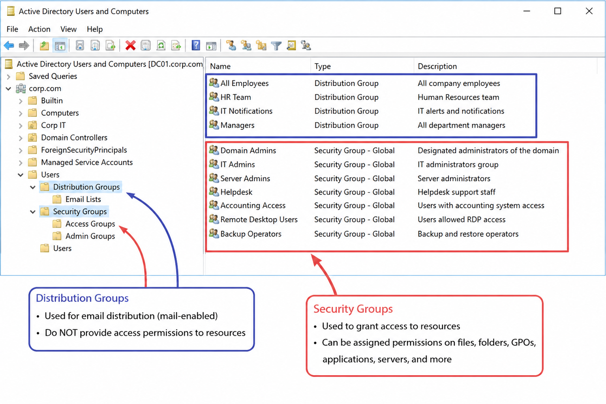
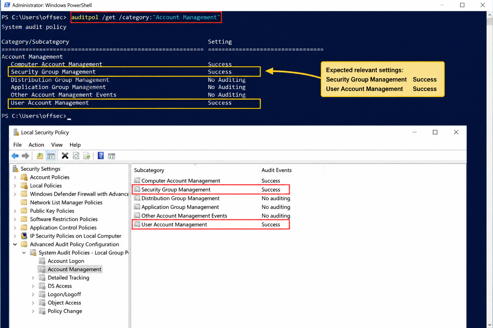
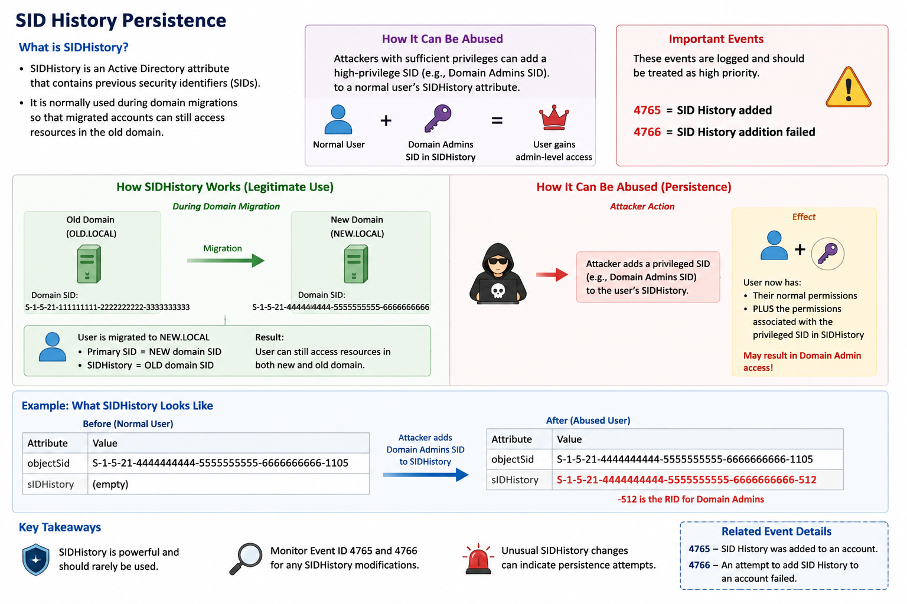

# 16. Active Directory Persistence

## Chapter Goal

This chapter explains how attackers maintain long-term access to an Active Directory environment after the initial compromise.

Main topics:

```text
Active Directory persistence
Privileged group membership changes
Domain user account modifications
Golden Tickets
Kerberos ticket inspection
Detection with Windows Security logs
Detection with PowerShell and XPath
```

Important defender idea:

```text
Removing the original compromised account may not remove the attacker.

The attacker may already have:
added another account to a privileged group,
created a new account,
modified an existing account,
or forged a long-lived Kerberos ticket.
```

---

# What Is Persistence?

Persistence means:

```text
Maintaining access after the original entry point is removed.
```

Examples:

```text
Adding a user to Domain Admins
Creating a hidden domain account
Changing a password
Setting a password to never expire
Adding SID History
Creating a Golden Ticket
```

Simple meaning:

```text
The attacker creates another way to return later.
```

---

# Why Active Directory Persistence Is Dangerous

Active Directory controls:

```text
users
groups
computers
permissions
authentication
domain policies
Kerberos tickets
```

If an attacker can modify Active Directory, they may create persistence that affects the entire domain or forest.

Example:

```text
An attacker compromises a Domain Admin account.

Defender disables that account.

But before it was disabled, the attacker added another normal user
to Domain Admins.

The attacker still has privileged access.
```

Therefore, incident response must investigate:

```text
what the compromised account changed
which users were modified
which groups were modified
which new accounts were created
which Kerberos credentials were exposed
```

---

# 16.1. Keeping Domain Access

The chapter focuses on three persistence areas:

```text
1. Domain group memberships
2. Domain user modifications
3. Golden Tickets
```

---

# 16.1.1. Domain Group Memberships

## Active Directory Group Types

There are two main types of groups:

```text
Distribution groups
Security groups
```



---

## Distribution Groups

Distribution groups are mainly used for email distribution.

Example:

```text
security-alerts@corp.com
all-employees@corp.com
management@corp.com
```

Simple meaning:

```text
Distribution group = email list
```

Distribution groups do not normally grant access to resources.

However, they may still create risk.

Example:

```text
An attacker removes security staff from an incident notification group.

Security staff no longer receive alerts.
```

---

## Security Groups

Security groups are used to grant permissions and access.

Examples:

```text
Domain Admins
Enterprise Admins
Administrators
Backup Operators
Remote Desktop Users
custom application access groups
```

Simple meaning:

```text
Security group = permission and access group
```

Adding an attacker-controlled account to a privileged security group can provide persistence.

---

# Important Privileged Groups (privileged security group)

## Domain Admins

```text
Scope: Global
```

Provides:

```text
full control of the domain
administrator rights on domain controllers
administrative rights on domain-joined computers
```

---

## Enterprise Admins

```text
Scope: Universal
```

Provides:

```text
full control across all domains in the forest
administrator rights on all domain controllers in the forest
```

This is one of the most powerful groups in Active Directory.

---

## Administrators

```text
Scope: Domain Local
```

Provides:

```text
administrative control over domain controllers in the domain
```

---

# Group Scope

A group scope defines where the group can be used.

| Scope | Meaning |
|---|---|
| Universal | Can be used across domains in the forest and trusted forests |
| Global | Can be assigned in the same forest or trusted domains/forests |
| Domain Local | Can be assigned only in the current domain |

Mapping:

| Group | Scope |
|---|---|
| Domain Admins | Global |
| Enterprise Admins | Universal |
| Administrators | Domain Local |

---

# Account Management Audit Policy

Group changes are logged through the:

```text
Account Management
```

audit category.

Check it with:

```powershell
auditpol /get /category:"Account Management"
```

Expected relevant settings:

```text
Security Group Management    Success
User Account Management      Success
```



---

## Security Group Management

This subcategory generates events when:

```text
a security group is created
a security group is changed
a security group is deleted
a member is added
a member is removed
a group changes between security and distribution type
```

Important:

```text
You do not need to configure a separate audit entry on every group.

The Security Group Management audit policy can log these changes directly.
```

---

# Group Membership Event IDs

| Event ID | Meaning |
|---:|---|
| 4728 | Member added to security-enabled global group |
| 4729 | Member removed from security-enabled global group |
| 4732 | Member added to security-enabled local group |
| 4733 | Member removed from security-enabled local group |
| 4756 | Member added to security-enabled universal group |
| 4757 | Member removed from security-enabled universal group |

---

## Easy Mapping

```text
Global group:
4728 = add
4729 = remove

Local group:
4732 = add
4733 = remove

Universal group:
4756 = add
4757 = remove
```

---

# Important Information in Group Change Events

These events answer three important questions:

```text
Who made the change?
Which account was added or removed?
Which group was modified?
```

Event sections:

```text
Subject
    account that performed the change

Member
    user or computer that was added or removed

Group
    group that was modified
```

Computer accounts normally end with:

```text
$
```

Example:

```text
CLIENT03$
SERVER01$
```

---

# XPath Filter for All Security Group Membership Changes

```xml
<QueryList>
  <Query Id="0" Path="Security">
    <Select Path="Security">
      *[System[
        (EventID=4728 or
         EventID=4729 or
         EventID=4732 or
         EventID=4733 or
         EventID=4756 or
         EventID=4757)
      ]]
    </Select>
  </Query>
</QueryList>
```

Meaning:

```text
Return every event where a member was added to
or removed from any security-enabled group.
```

---

# XPath Filter for Privileged Groups Only

```xml
<QueryList>
  <Query Id="0" Path="Security">
    <Select Path="Security">
      *[System[
        (EventID=4728 or
         EventID=4729 or
         EventID=4732 or
         EventID=4733 or
         EventID=4756 or
         EventID=4757)
      ]]
      and
      *[EventData[
        Data[@Name='TargetUserName']
        and
        (Data='Domain Admins' or
         Data='Administrators' or
         Data='Enterprise Admins')
      ]]
    </Select>
  </Query>
</QueryList>
```

Meaning:

```text
Only show membership changes affecting:
Domain Admins,
Administrators,
or Enterprise Admins.
```

---

# Security Group Audit Script

```powershell
Function Get-ChangeType ([System.String]$Id) {
    Begin {
        $ChangeTable = @{
            '4728' = '(4728) A member was added to a security-enabled global group.'
            '4729' = '(4729) A member was removed from a security-enabled global group.'
            '4732' = '(4732) A member was added to a security-enabled local group.'
            '4733' = '(4733) A member was removed from a security-enabled local group.'
            '4756' = '(4756) A member was added to a security-enabled universal group.'
            '4757' = '(4757) A member was removed from a security-enabled universal group.'
        }
    }
    Process {
        $Value = $ChangeTable[$Id]

        If (!$Value) {
            $Value = $Id
        }
    }
    End {
        return $Value
    }
}

$FilterXML = @'
<QueryList>
  <Query Id="0" Path="Security">
    <Select Path="Security">
      *[System[
        (EventID=4728 or
         EventID=4729 or
         EventID=4732 or
         EventID=4733 or
         EventID=4756 or
         EventID=4757)
      ]]
      and
      *[EventData[
        Data[@Name='TargetUserName']
        and
        (Data='Administrators' or
         Data='Domain Admins' or
         Data='Enterprise Admins')
      ]]
    </Select>
  </Query>
</QueryList>
'@

$Logs = Get-WinEvent -FilterXml $FilterXML

ForEach ($L in $Logs) {
    [xml]$XML = $L.ToXml()

    $EventID = $XML.Event.System.EventID
    $TimeStamp = $XML.Event.System.TimeCreated.SystemTime
    $MemberName = $XML.Event.EventData.Data[0].'#text'
    $GroupName = $XML.Event.EventData.Data[2].'#text'
    $SubjectUserName = $XML.Event.EventData.Data[6].'#text'
    $ChangeType = Get-ChangeType -Id $EventID

    [PSCustomObject]@{
        'TimeStamp'       = $TimeStamp
        'MemberName'      = $MemberName
        'GroupName'       = $GroupName
        'SubjectUserName' = $SubjectUserName
        'ChangeType'      = $ChangeType
    }
}
```

---

# What `Get-ChangeType` Does

The function translates an event ID into a readable description.

Example:

```text
4728
```

becomes:

```text
A member was added to a security-enabled global group.
```

Without the helper function, the script would only show:

```text
4728
```

With the helper function, the result is easier to understand.

---

# Example Group Change Result

```text
TimeStamp       : 2022-01-19T18:46:30.146129500Z
MemberName      : CN=John Doe,OU=Staff,DC=corp,DC=com
GroupName       : Enterprise Admins
SubjectUserName : Administrator
ChangeType      : (4756) A member was added to a security-enabled universal group.
```

Meaning:

```text
Administrator added John Doe to Enterprise Admins.
```

This is a critical security event.

---

# Defender Response to Privileged Group Changes

Investigate:

```text
Was the change authorized?
Who performed it?
Was the account compromised?
Was the member supposed to be added?
How long did the membership exist?
Did the member log in afterward?
Did the member access domain controllers?
Was the member later removed?
```

Useful correlation:

```text
4728/4732/4756
→ user added to privileged group

4624
→ user logs in

4672
→ special privileges assigned

4688
→ suspicious process execution

7045
→ service installation

4769
→ Kerberos service ticket request
```

---

# 16.1.2. Domain User Modifications

## Why User Modifications Matter

An attacker with account-management privileges may:

```text
create a new account
enable a disabled account
reset a password
change a password
rename an account
unlock an account
set password never expires
change account flags
add SID History
modify account permissions
```

These changes can provide persistence.

---

## Example Persistence Scenario

```text
Attacker compromises dadmin.

dadmin normally creates and manages employee accounts.

Attacker uses dadmin to:
create a new account named notahacker,
reset its password,
enable it,
or change its account settings.
```

Even if `dadmin` is later disabled:

```text
notahacker may remain active.
```

---

# User Account Management Audit Policy

Relevant subcategory:

```text
User Account Management
```

Check with:

```powershell
auditpol /get /category:"Account Management"
```

Expected:

```text
User Account Management    Success
```

---

# Filtering Changes Made by a Specific Account

The chapter filters for:

```text
SubjectUserName = dadmin
```

XPath:

```xml
<QueryList>
  <Query Id="0" Path="Security">
    <Select Path="Security">
      *[System[
        Provider[@Name='Microsoft-Windows-Security-Auditing']
        and
        Task=13824
      ]]
      and
      *[EventData[
        Data[@Name='SubjectUserName']
        and
        (Data='dadmin')
      ]]
    </Select>
  </Query>
</QueryList>
```

Meaning:

```text
Find user-account-management events
where dadmin performed the action.
```

---

# Important User Account Event IDs

| Event ID | Meaning |
|---:|---|
| 4720 | User account created |
| 4722 | User account enabled |
| 4723 | Attempt to change account password |
| 4724 | Attempt to reset account password |
| 4738 | User account changed |
| 4740 | User account locked out |
| 4765 | SID History added to account |
| 4766 | Attempt to add SID History failed |
| 4767 | User account unlocked |
| 4780 | ACL set on accounts in administrator groups |
| 4781 | Account name changed |
| 4794 | Attempt to set DSRM administrator password |
| 4798 | User local-group membership enumerated |
| 5376 | Credential Manager credentials backed up |
| 5377 | Credential Manager credentials restored |
| 5379 | Credential Manager credentials read |

---

# User Change Helper Function

```powershell
Function Get-ChangeType ([System.String]$EventId) {
    Begin {
        $ChangeTable = @{
            '4720' = "($EventId) A user account was created."
            '4722' = "($EventId) A user account was enabled."
            '4723' = "($EventId) An attempt was made to change an account's password."
            '4724' = "($EventId) An attempt was made to reset an account's password."
            '4738' = "($EventId) A user account was changed."
            '4740' = "($EventId) A user account was locked out."
            '4765' = "($EventId) SID History was added to an account."
            '4766' = "($EventId) An attempt to add SID History to an account failed."
            '4767' = "($EventId) A user account was unlocked."
            '4780' = "($EventId) The ACL was set on accounts which are members of administrators groups."
            '4781' = "($EventId) The name of an account was changed."
            '4794' = "($EventId) An attempt was made to set the Directory Services Restore Mode administrator password."
            '4798' = "($EventId) A user's local group membership was enumerated."
            '5376' = "($EventId) Credential Manager credentials were backed up."
            '5377' = "($EventId) Credential Manager credentials were restored from a backup."
            '5379' = "($EventId) Credential Manager credentials were read."
        }
    }
    Process {
        $Value = $ChangeTable[$EventId]

        If (!$Value) {
            $Value = $EventId
        }
    }
    End {
        return $Value
    }
}
```

---

# Example User Change Output

```text
TimeStamp       : 2022-03-09T19:57:30.859931700Z
SubjectUserName : dadmin
TargetUserName  : notahacker
ChangeType      : (4724) An attempt was made to reset an account's password.
```

Another event:

```text
TimeStamp       : 2022-03-09T19:57:30.859864400Z
SubjectUserName : dadmin
TargetUserName  : notahacker
ChangeType      : (4738) A user account was changed.
```

Meaning:

```text
dadmin reset the password for notahacker
and modified the account.
```

---

# Why Event 4738 Is Important

Event ID:

```text
4738
```

Meaning:

```text
A user account was changed.
```

Possible changes include:

```text
display name
user principal name
home directory
script path
account expiration
userAccountControl flags
password settings
logon restrictions
```

One persistence example:

```text
Password Never Expires
```

An attacker may enable this so the account remains usable.

---

# Event 4720: Account Created

Event:

```text
4720
```

Meaning:

```text
A user account was created.
```

This is especially suspicious when:

```text
created outside normal onboarding hours
created by a compromised administrator
name resembles a service account
account is immediately enabled
account is immediately added to a privileged group
account has password-never-expires enabled
```

---

# Event 4724: Password Reset

Event:

```text
4724
```

Meaning:

```text
An attempt was made to reset another account's password.
```

Difference:

```text
4723
    user attempts to change a password,
    normally requiring the old password

4724
    privileged account resets another user's password,
    normally without knowing the old password
```

---

# SID History Persistence

## What Is SID History?

`SIDHistory` is an Active Directory attribute containing previous security identifiers.

It is normally used during domain migrations.

Example:

```text
Old domain SID is stored in SIDHistory
so the migrated account can still access old resources.
```

Attackers may abuse it by adding a privileged SID.

Example concept:

```text
Normal user
+ Domain Admins SID in SIDHistory
= may receive access associated with Domain Admins
```

Important events:

```text
4765 = SID History added
4766 = SID History addition failed
```

These events should be treated as high priority.



---

# Defender Response to User Modifications

Investigate:

```text
Who made the change?
Which account was changed?
Was a new account created?
Was the password reset?
Was the account enabled?
Was Password Never Expires enabled?
Was SID History added?
Was the account added to privileged groups?
Did the account log in afterward?
```

Useful event sequence:

```text
4720
    account created

4722
    account enabled

4724
    password reset

4738
    account changed

4728/4732/4756
    account added to privileged group

4624
    account logs in
```

This sequence strongly suggests persistence.

---

# 16.1.3. Golden Tickets

## What Is a Golden Ticket?

A Golden Ticket is a forged Kerberos Ticket Granting Ticket.

It is created using secret key material belonging to the:

```text
krbtgt account
```

Simple meaning:

```text
The attacker creates a fake TGT that the domain trusts.
```

---

# Kerberos Review

Kerberos uses a Key Distribution Center.

In Active Directory, the KDC runs on domain controllers.

The KDC provides:

```text
TGTs
service tickets
```

---

## TGT

TGT means:

```text
Ticket Granting Ticket
```

The user receives a TGT after authenticating.

The TGT proves:

```text
The KDC authenticated this identity.
```

---

## TGS / Service Ticket

The user presents the TGT to the KDC and requests access to a service.

The KDC returns a service ticket.

Example:

```text
TGT
→ request ticket for CIFS/DC01
→ KDC returns service ticket
→ user accesses SMB on DC01
```

---

# The `krbtgt` Account

`krbtgt` is a special built-in Active Directory account. (https://adsecurity.org/?p=483)

Its secret is used to sign and protect Kerberos TGTs.

Simple relationship:

```text
krbtgt secret
→ signs TGT
→ KDC trusts TGT
```

If an attacker obtains the `krbtgt` hash/key:

```text
they can forge TGTs
```

---

# Golden Ticket Attack Concept

```text
Attacker compromises Domain Admin or Domain Controller
→ attacker extracts krbtgt secret
→ attacker creates forged TGT
→ ticket claims to represent any chosen user
→ ticket may include privileged group memberships
→ KDC accepts the forged ticket
→ attacker requests service tickets
→ attacker accesses domain resources
```

---

# Why Golden Tickets Are Powerful

A Golden Ticket may allow an attacker to:

```text
impersonate any domain user
claim privileged group membership
request service tickets
access domain resources
maintain access for a long time
continue operating after normal passwords change
```

The attacker may forge a ticket for:

```text
Administrator
Domain Admin
Enterprise Admin
a nonexistent username
```

The important element is that the ticket is signed with trusted `krbtgt` key material.

---

# Why It Is Persistence

Changing the compromised user's password may not remove the attacker.

The forged ticket is based on:

```text
krbtgt secret
```

not the original user's password.

Persistence remains possible until the `krbtgt` password/key is correctly rotated.

---

# Normal Kerberos Ticket Times

A normal ticket includes:

```text
Start Time
End Time
Renew Time
```

Example:

```text
Start Time: current time
End Time: approximately 10 hours later
Renew Time: approximately 7 days later
```

---

## Ticket Time Meanings

### Start Time

```text
When the ticket becomes valid.
```

### End Time

```text
When the ticket expires.
```

### Renew Time

```text
Final time until which the ticket may be renewed.
```

---

# Viewing Tickets with `klist`

Show tickets for the current logon session:

```powershell
klist
```

Example:

```text
Client: offsec @ CORP.COM
Server: krbtgt/CORP.COM @ CORP.COM
Start Time: 3/9/2022 12:30:03
End Time:   3/9/2022 22:30:03
Renew Time: 3/16/2022 12:30:03
```

---

# Normal Ticket Example

```text
Start: 12:30
End:   22:30
```

Approximately:

```text
10 hours
```

Renewal:

```text
7 days
```

---

# Suspicious Golden Ticket Example

```text
Start Time: 3/9/2022
End Time:   3/6/2032
Renew Time: 3/6/2032
```

This is approximately:

```text
10 years
```

Such a long lifetime is highly suspicious.

---

# Domain Kerberos Policy

The chapter retrieves Kerberos policy from:

```text
Default Domain Policy
```

using:

```powershell
Get-GPOReport
```

`Get-GPOReport` is part of the:

```text
GroupPolicy PowerShell module
```

It is available when the relevant RSAT tools are installed.

---

# Get-KerberosSettings Function

```powershell
Function Get-KerberosSettings {
    Begin {
        [xml]$XML = Get-GPOReport `
            -Name 'Default Domain Policy' `
            -ReportType xml
    }
    Process {
        $Kerberos = $XML.GPO.Computer.ExtensionData.Extension.Account |
            Where-Object { $_.Type -eq 'Kerberos' }
    }
    End {
        return [PSCustomObject]@{
            'MaxClockSkew'         = $Kerberos[0].SettingNumber
            'MaxRenewAge'          = $Kerberos[1].SettingNumber
            'MaxServiceAge'        = $Kerberos[2].SettingNumber
            'MaxTicketAge'         = $Kerberos[3].SettingNumber
            'TicketValidateClient' = $Kerberos[4].SettingBoolean
        }
    }
}
```

---

# Kerberos Settings Explained

Example output:

```text
MaxClockSkew         : 5
MaxRenewAge          : 7
MaxServiceAge        : 600
MaxTicketAge         : 10
TicketValidateClient : true
```

Meanings:

| Setting | Unit | Meaning |
|---|---|---|
| MaxClockSkew | Minutes | Allowed time difference between systems |
| MaxRenewAge | Days | Maximum renewal lifetime |
| MaxServiceAge | Minutes | Maximum service-ticket lifetime |
| MaxTicketAge | Hours | Maximum TGT lifetime |
| TicketValidateClient | Boolean | Whether client restrictions are validated |

---

# Example Thresholds

```text
MaxClockSkew  = 5 minutes
MaxRenewAge   = 7 days
MaxServiceAge = 600 minutes
MaxTicketAge  = 10 hours
```

A ticket exceeding these values may be suspicious.

---

# Logon Sessions and Tickets

Kerberos tickets are associated with:

```text
logon sessions
```

Every logon session has a:

```text
Logon ID
```

Example:

```text
0xa54c6
0x3e7
```

---

# Show All Logon Sessions

```powershell
klist sessions
```

Example:

```text
Session 2 0xa5996 CORP\offsec Negotiate:RemoteInteractive
Session 2 0xa54c6 CORP\offsec Kerberos:RemoteInteractive
Session 0 0x3e7 CORP\CLIENT03$ Negotiate:(0)
```

---

# Show Tickets for a Specific Session

```powershell
klist -li 0x3e7
```

Meaning:

```text
Show tickets associated with logon ID 0x3e7.
```

---

# Important Logon ID

```text
0x3e7
```

Commonly represents:

```text
LocalSystem
```

or a machine/system security context.

---

# One-Liner to Dump Tickets from All Sessions

```powershell
(klist sessions 2>&1) |
Where-Object { $_ -like '* Session*' } |
ForEach-Object {
    (($_ -split ' ')[3]).Substring(2)
} |
ForEach-Object {
    klist -li $_
}
```

Meaning:

```text
Run klist sessions
→ find session lines
→ extract each Logon ID
→ run klist for every Logon ID
```

Problem:

```text
It produces a very large amount of text.
```

The chapter creates structured functions to solve this.

---

# Get-LogonIds Function

```powershell
Function Get-LogonIds {
    Begin {
        $Klist = klist sessions
    }
    Process {
        $Sessions = $Klist |
            Where-Object { $_ -like '* Session*' } |
            ForEach-Object {
                (($_ -split ' ')[3]).Substring(2)
            }
    }
    End {
        return $Sessions
    }
}
```

Purpose:

```text
Return every logon ID on the current computer.
```

---

# Get-Tickets Function

```powershell
Function Get-Tickets {
    [CmdletBinding()]
    param (
        [Parameter(
            Mandatory = $false,
            ValueFromPipeline = $true
        )]
        [System.String]$LogonId
    )

    Begin {
        $CachedTickets = @()
        $Klist = klist
        $Current = ((($Klist) -split 'Current LogonId is')[2] -split ':')[1]
    }

    Process {
        try {
            if ($LogonId -eq $Current -or $LogonId -eq '') {
                $Klist = klist
                $LogonId = $Current
            }
            else {
                $Klist = klist -li $LogonId
            }

            $Tickets = 5..$Klist.Count |
                ForEach-Object { $Klist[$_] } |
                Where-Object { $_ }

            if ($Klist -notcontains 'Cached Tickets: (0)') {
                0..$(($Tickets | Select-String "^#\d>").Count - 1) |
                ForEach-Object {
                    $Index = $_ * 10

                    $Properties = [ordered]@{
                        'LogonId'        = $LogonId
                        'Ticket'         = $_
                        'Client'         = $($Tickets[0 + $Index] -split ':')[1].Trim()
                        'Server'         = $($Tickets[1 + $Index] -split ':')[1].Trim()
                        'EncryptionType' = $($Tickets[2 + $Index] -split ':')[1].Trim()
                        'TicketFlags'    = $($Tickets[3 + $Index] -split 'Ticket Flags')[1].Trim()
                        'StartTime'      = $($Tickets[4 + $Index] -split 'Start Time:')[1].Trim()
                        'EndTime'        = $($Tickets[5 + $Index] -split 'End Time:')[1].Trim()
                        'RenewTime'      = $($Tickets[6 + $Index] -split 'Renew Time:')[1].Trim()
                        'SessionKeyType' = $($Tickets[7 + $Index] -split ':')[1].Trim()
                        'CacheFlags'     = $($Tickets[8 + $Index] -split ':')[1].Trim()
                        'KdcCalled'      = $($Tickets[9 + $Index] -split ':')[1].Trim()
                    }

                    if ($Properties) {
                        $CachedTickets += New-Object `
                            -TypeName PSObject `
                            -Property $Properties
                    }
                }
            }
        }
        catch {
            if ($_ -like "*Error calling API*") {
                $_ | Out-Null
            }
        }
    }

    End {
        return $CachedTickets
    }
}
```

---

# What `Get-Tickets` Does

For every logon ID, it:

```text
runs klist
retrieves cached tickets
parses text output
extracts relevant fields
creates PowerShell objects
```

Extracted fields:

```text
LogonId
Ticket number
Client
Server
EncryptionType
TicketFlags
StartTime
EndTime
RenewTime
SessionKeyType
CacheFlags
KdcCalled
```

---

# Running Both Functions

```powershell
Get-LogonIds | Get-Tickets
```

Flow:

```text
Get-LogonIds
→ returns all logon IDs
→ each ID is sent through the pipeline
→ Get-Tickets retrieves tickets for each session
```

---

# Example Suspicious Ticket

```text
LogonId        : 0xa54c6
Client         : dadmin @ corp.com
Server         : krbtgt/corp.com @ corp.com
EncryptionType : RSADSI RC4-HMAC(NT)
StartTime      : 3/9/2022
EndTime        : 3/6/2032
RenewTime      : 3/6/2032
KdcCalled      :
```

Suspicious indicators:

```text
ticket lifetime of approximately ten years
RC4 encryption in an environment that normally uses AES
empty KdcCalled field
unexpected forged user
```

---

# Sort Tickets by Expiration

```powershell
Get-LogonIds |
Get-Tickets |
Select-Object LogonId,StartTime,EndTime |
Sort-Object EndTime
```

Purpose:

```text
Find tickets with unusual expiration dates.
```

---

# Invoke-GoldenSweep Function

```powershell
Function Invoke-GoldenSweep {
    [CmdletBinding()]
    param (
        [Parameter(
            Mandatory = $true,
            ValueFromPipeline = $true
        )]
        $Ticket
    )

    Process {
        $Flagged = $null

        $StartTime = ($Ticket.StartTime -split ' ')[0]
        $EndTime = ($Ticket.EndTime -split ' ')[0]
        $RenewTime = ($Ticket.RenewTime -split ' ')[0]

        if ((New-TimeSpan -Start $StartTime -End $EndTime).Days -gt 10) {
            $Flagged = $Ticket
        }

        if ($RenewTime -ne 0) {
            if ((New-TimeSpan -Start $StartTime -End $RenewTime).Days -gt 7) {
                $Flagged = $Ticket
            }
        }
    }

    End {
        return $Flagged
    }
}
```

---

# What `Invoke-GoldenSweep` Does

It checks every ticket for suspicious time values.

Checks:

```text
StartTime to EndTime
StartTime to RenewTime
```

Flags the ticket if:

```text
ticket lifetime exceeds expected threshold
renewal lifetime exceeds seven days
```

---

# Run the Golden Ticket Detection Chain

```powershell
Get-LogonIds |
Get-Tickets |
Invoke-GoldenSweep
```

Flow:

```text
Get all logon IDs
→ retrieve all tickets
→ check ticket times
→ return suspicious tickets
```

---

# Important Note About the Time Check

The domain example uses:

```text
MaxTicketAge = 10 hours
MaxRenewAge  = 7 days
```

The chapter's example function checks whether the End Time exceeds ten days:

```powershell
.Days -gt 10
```

For a production-quality script, the comparison should use the real domain policy values and correct units.

A more precise approach would compare:

```text
ticket age against MaxTicketAge in hours
renewal age against MaxRenewAge in days
```

Example concept:

```powershell
$TicketAge = New-TimeSpan -Start $StartTime -End $EndTime

if ($TicketAge.TotalHours -gt $MaxTicketAge) {
    $Flagged = $Ticket
}
```

---

# Encryption-Type Detection

Normal modern environments often use:

```text
AES-128
AES-256
```

A Golden Ticket made with an NTLM hash may use:

```text
RC4-HMAC
```

Example suspicious value:

```text
RSADSI RC4-HMAC(NT)
```

The source text later shows:

```text
RSADSA RC4-HMAC(NT)
```

That appears to be a spelling inconsistency.

The value shown by `klist` in the chapter is:

```text
RSADSI RC4-HMAC(NT)
```

---

## Add Encryption Detection

```powershell
$EncryptionType = $Ticket.EncryptionType

if ($EncryptionType -eq 'RSADSI RC4-HMAC(NT)') {
    $Flagged = $Ticket
}
```

Important:

```text
RC4 alone is not absolute proof of a Golden Ticket.

Some legitimate older environments may still use RC4.
```

It becomes more suspicious when combined with:

```text
very long ticket lifetime
empty KdcCalled
unexpected user
unusual logon session
environment normally using AES
```

---

# Golden Ticket Detection Indicators

Potential indicators:

```text
End Time much longer than domain policy
Renew Time much longer than domain policy
RC4 ticket in AES-dominant environment
KdcCalled field empty
ticket for unexpected or nonexistent user
ticket claims privileged identity
unusual group memberships
ticket appears in unusual logon session
```

---

# `KdcCalled` Indicator

A normal ticket commonly shows:

```text
Kdc Called: DC01
```

A forged or injected ticket may show:

```text
Kdc Called:
```

because it may not have been obtained normally from a KDC.

Important:

```text
An empty KdcCalled field is an indicator,
not definitive proof by itself.
```

---

# Remediating Golden Ticket Risk

Golden Ticket persistence depends on the:

```text
krbtgt account secret
```

Changing a normal user's password is not enough.

The `krbtgt` password must be rotated correctly.

---

## Why `krbtgt` Must Be Changed Twice

Active Directory keeps the current and previous `krbtgt` keys.

When ticket validation using the current key fails, the KDC may try the previous key.

Therefore:

```text
One password reset invalidates only the current key.

A second controlled reset invalidates the previous key as well.
```

Simple meaning:

```text
Reset krbtgt twice, with proper replication and planning.
```

This must be performed carefully because it affects Kerberos authentication across the domain.

---

# Important Persistence Events

## Group Persistence

```text
4728
4729
4732
4733
4756
4757
```

---

## User Persistence

```text
4720
4722
4723
4724
4738
4765
4766
4767
4780
4781
4794
```

---

## Kerberos Persistence

Golden Tickets may not always create one simple event proving their creation.

Detection relies on:

```text
ticket inspection
ticket time anomalies
encryption anomalies
authentication behavior
unexpected privileged access
```

---

# Main Attack and Detection Relationships

## Privileged Group Persistence

```text
Attack:
Add attacker-controlled account to privileged group

Detection:
4728 = global group member added
4732 = local group member added
4756 = universal group member added
```

Example:

```text
User added to Domain Admins
→ Event 4728
```

---

## User Account Persistence

```text
Attack:
Create or modify domain account

Detection:
4720 = account created
4722 = account enabled
4724 = password reset
4738 = account changed
4765 = SID History added
```

---

## Golden Ticket Persistence

```text
Attack:
Steal krbtgt secret
→ forge TGT
→ impersonate privileged user

Detection:
long ticket lifetime
long renewal period
RC4 ticket in AES environment
empty KdcCalled
unexpected client identity
```

---

# Defender Investigation Workflow

## Step 1: Identify Compromised Administrator

Determine:

```text
which privileged account was compromised
when compromise started
which systems it accessed
```

---

## Step 2: Review Group Changes

Search:

```text
4728
4729
4732
4733
4756
4757
```

Focus on:

```text
Domain Admins
Enterprise Admins
Administrators
custom privileged groups
```

---

## Step 3: Review User Changes

Search:

```text
4720
4722
4723
4724
4738
4765
4767
4781
```

Determine:

```text
new accounts
password resets
account flags
renamed accounts
SID History additions
```

---

## Step 4: Correlate Authentication

Search:

```text
4624 successful logons
4625 failed logons
4672 special privileges assigned
4768 TGT requested
4769 service ticket requested
```

---

## Step 5: Inspect Kerberos Tickets

Use:

```powershell
klist
klist sessions
klist -li <LogonId>
```

Then:

```powershell
Get-LogonIds |
Get-Tickets |
Invoke-GoldenSweep
```

---

## Step 6: Contain and Remediate

Possible actions:

```text
disable compromised accounts
remove unauthorized group memberships
remove malicious accounts
reset affected passwords
review SID History
revoke active sessions
rotate krbtgt twice when required
monitor for renewed access
```

---

# Useful Commands

## Check Account Management Auditing

```powershell
auditpol /get /category:"Account Management"
```

## Query Group Changes

```powershell
Get-WinEvent -FilterXml $FilterXML
```

## Show Current Kerberos Tickets

```powershell
klist
```

## Show Logon Sessions

```powershell
klist sessions
```

## Show Tickets for One Session

```powershell
klist -li 0x3e7
```

## Retrieve Kerberos Domain Settings

```powershell
Get-KerberosSettings
```

## Retrieve All Cached Tickets

```powershell
Get-LogonIds | Get-Tickets
```

## Find Suspicious Ticket Lifetimes

```powershell
Get-LogonIds |
Get-Tickets |
Invoke-GoldenSweep
```

---

# MITRE ATT&CK Mapping

Relevant techniques include:

```text
T1098 – Account Manipulation
T1098.001 – Additional Cloud Roles
T1098.002 – Additional Email Delegate Permissions
T1098.003 – Additional Cloud Roles
T1098.004 – SSH Authorized Keys
T1136.002 – Create Account: Domain Account
T1078.002 – Valid Accounts: Domain Accounts
T1558.001 – Steal or Forge Kerberos Tickets: Golden Ticket
T1484.001 – Domain Policy Modification
```

Most directly relevant:

```text
Account Manipulation
Create Domain Account
Additional Group Membership
Golden Ticket
Valid Accounts
```

---

# Quick Event Table

| Event ID | Meaning |
|---:|---|
| 4720 | User account created |
| 4722 | User account enabled |
| 4723 | Password change attempted |
| 4724 | Password reset attempted |
| 4728 | Member added to global security group |
| 4729 | Member removed from global security group |
| 4732 | Member added to local security group |
| 4733 | Member removed from local security group |
| 4738 | User account changed |
| 4740 | Account locked out |
| 4756 | Member added to universal security group |
| 4757 | Member removed from universal security group |
| 4765 | SID History added |
| 4766 | SID History addition failed |
| 4767 | Account unlocked |
| 4780 | ACL set on privileged account |
| 4781 | Account renamed |
| 4794 | DSRM password change attempted |
| 4798 | User local-group membership enumerated |

---

# Final Quick Summary

```text
Active Directory persistence allows attackers to maintain access
after the original compromised account is removed.

Three major persistence areas in this chapter:

1. Privileged group membership changes
2. Domain user modifications
3. Golden Tickets

Privileged group changes:
4728/4729 = global group
4732/4733 = local group
4756/4757 = universal group

Important groups:
Domain Admins
Enterprise Admins
Administrators

User persistence:
4720 = account created
4722 = account enabled
4724 = password reset
4738 = account changed
4765 = SID History added

Golden Ticket:
forged Kerberos TGT signed using krbtgt key material.

Important Golden Ticket indicators:
ticket lifetime exceeds domain policy
renewal period exceeds domain policy
RC4 used in AES environment
empty KdcCalled field
unexpected user or privilege level

Useful commands:
auditpol
Get-WinEvent
klist
klist sessions
klist -li

Best defender approach:
review all changes made by compromised privileged accounts,
correlate account and group events,
inspect Kerberos tickets,
remove unauthorized persistence,
and rotate krbtgt correctly when required.
```