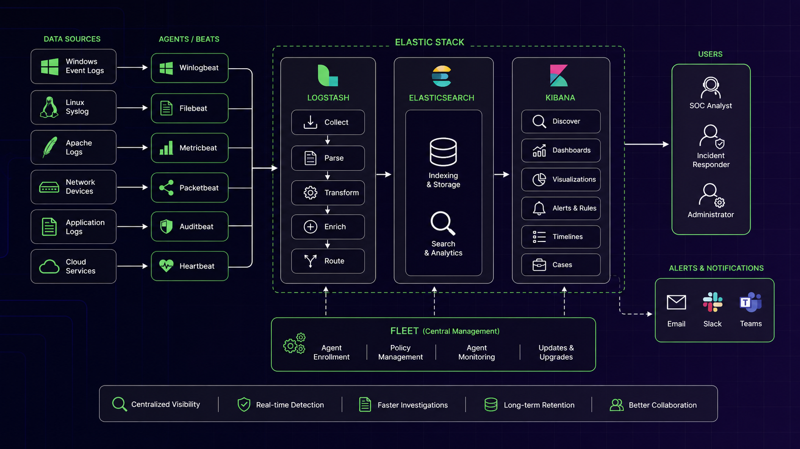
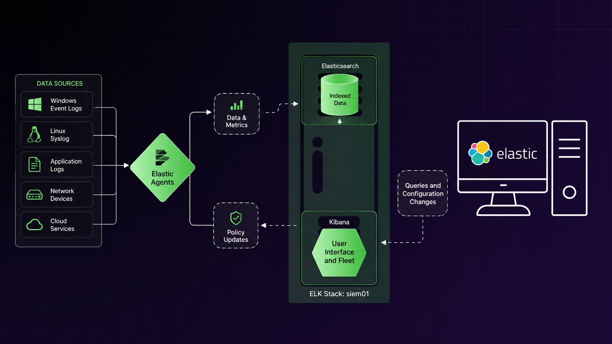

# SIEM Part One: Introduction to ELK

## Chapter Goal

This chapter explains how enterprises collect, centralize, search, analyze, and alert on security data using a SIEM.

Important defender idea:

```text
Security analysts should not need to connect manually
to every endpoint to investigate an incident.

Logs and endpoint data should be collected centrally,
searched from one interface,
and used to generate automatic alerts.
```

---

# 1. Log Management Introduction

## What Is Log Management?

Log management means:

```text
collecting,
storing,
organizing,
searching,
and reviewing logs
from multiple systems.
```

Examples of log sources:

```text
Windows Event Logs
Sysmon
Linux Syslog
Apache access logs
IIS logs
Snort alerts
Firewall logs
Application logs
Authentication logs
Cloud logs
```

Simple meaning:

```text
Log management puts important system records
in one place for investigation and auditing.
```

---

## Why Local Logs Are Not Enough

Logs stored only on individual endpoints create several problems:

```text
limited disk space
short retention periods
logs may be deleted by attackers
analysts must connect to every endpoint
different systems use different formats
large environments produce too much data
```

Example:

```text
1000 computers
+ 100 servers
+ firewalls
+ web servers
+ cloud systems
= too many systems to investigate manually
```

A centralized platform solves this problem.

---

# 1.1. SIEM Concepts

## SIM

SIM means:

```text
Security Information Management
```

SIM focuses mainly on:

```text
collecting logs
storing logs
retaining logs
searching historical logs
reporting
```

Simple meaning:

```text
SIM = long-term storage and analysis of security information.
```

---

## SEM

SEM means:

```text
Security Event Management
```

SEM focuses mainly on:

```text
real-time event monitoring
endpoint agents
process information
system state
active alerts
near-real-time metadata
```

Simple meaning:

```text
SEM = real-time monitoring of security events.
```

---

## SIM vs SEM

| Product | Main Focus |
|---|---|
| SIM | Historical log collection and retention |
| SEM | Real-time monitoring and event detection |

Example:

```text
SIM:
Store firewall logs for six months.

SEM:
Alert immediately when malware starts a process.
```

---

# SIEM

SIEM means:

```text
Security Information and Event Management
```

A SIEM combines the capabilities of SIM and SEM.

It can:

```text
collect logs
collect endpoint telemetry
normalize data
index data
search data
correlate events
create alerts
support investigations
retain historical evidence
generate dashboards
```

Simple meaning:

```text
SIEM = centralized security monitoring and investigation platform.
```

---

## SIEM Data Flow

```text
Endpoints and network devices
→ agents or log forwarders
→ SIEM ingestion
→ parsing and normalization
→ indexing
→ searching and correlation
→ alerts and investigation
```

---

## Single Pane of Glass

A SIEM is often described as a:

```text
single pane of glass
```

Meaning:

```text
Analysts can view logs, alerts, dashboards,
and investigation data from one interface.
```

---

## Common SIEM Products

Examples include:

```text
Elastic Security
Splunk Enterprise Security
IBM QRadar
Microsoft Sentinel
LogRhythm
ArcSight
SolarWinds Security Event Manager
```

---

# 1.2. Elastic Stack

## What Is ELK?

ELK originally refers to:

```text
Elasticsearch
Logstash
Kibana
```



The modern Elastic Stack also includes:

```text
Elastic Agent
Fleet
Beats components
Elastic Security
Integrations
OSQuery
```

---

# Elasticsearch

## What Is Elasticsearch?

Elasticsearch is the data indexing and search engine.

It is responsible for:

```text
storing indexed data
searching large datasets
organizing fields
returning query results
supporting analytics
```

Simple meaning:

```text
Elasticsearch is the searchable database engine.
```

Example:

```text
Search all Windows events
where event.code = 4625
and source.ip = 172.16.50.254.
```

---

## Indexing

Indexing means organizing data so it can be searched quickly.

Example event:

```json
{
  "host.hostname": "appsrv01",
  "event.code": "4625",
  "source.ip": "172.16.50.254",
  "user.name": "Administrator"
}
```

Elasticsearch stores these fields in a searchable structure.

---

# Logstash

## What Is Logstash?

Logstash is a data-processing pipeline.

It can:

```text
receive data
parse data
transform data
enrich data
send data to Elasticsearch
route data to different outputs
```

Simple meaning:

```text
Logstash receives raw logs,
converts them into structured data,
and forwards them for storage.
```

---

## Example Logstash Flow

```text
Raw Apache log
→ Logstash parser
→ fields extracted
→ source.ip
→ url.path
→ status code
→ user agent
→ Elasticsearch
```

---

## Is Logstash Always Required?

No.

In modern Elastic deployments:

```text
Elastic Agent may send data directly to Elasticsearch.
```

Therefore:

```text
Logstash is optional.
```

It is still useful when:

```text
complex parsing is needed
multiple pipelines are required
data must be enriched
custom routing is needed
external storage is used
```

---

# Kibana

## What Is Kibana?

Kibana is the web interface for the Elastic Stack.

It provides:

```text
search interface
dashboards
Discover
rules
alerts
timelines
cases
Fleet management
OSQuery interface
administration
RBAC
```

Simple meaning:

```text
Kibana is the GUI analysts use to interact with Elastic.
```

Default port commonly used:

```text
5601
```

Example lab URL:

```text
http://<proxy-or-kibana-ip>:5601
```

---

# Beats

## What Are Beats?

Beats are lightweight, purpose-specific data shippers.

Examples:

```text
Winlogbeat
Filebeat
Metricbeat
Auditbeat
Packetbeat
Heartbeat
```

Examples of purpose:

```text
Winlogbeat → Windows Event Logs
Filebeat   → log files
Metricbeat → system metrics
Auditbeat  → Linux audit/security data
Packetbeat → network protocol metadata
Heartbeat  → service availability
```

---

## Traditional ELK Architecture

```text
Endpoint
→ Beat
→ Logstash
→ Elasticsearch
→ Kibana
```

Each Beat had its own configuration.

---

# Elastic Agent

## What Is Elastic Agent?

Elastic Agent is a unified endpoint agent.

Instead of installing several separate Beats, Elastic Agent can collect multiple kinds of data.

It can collect:

```text
Windows events
Syslog
application logs
system metrics
endpoint telemetry
security data
OSQuery results
```



Simple meaning:

```text
Elastic Agent replaces many separate Beats
with one centrally managed agent.
```

---

# Fleet

## What Is Fleet?

Fleet is the central management service for Elastic Agents.

Fleet allows administrators to:

```text
enroll agents
assign policies
push configuration changes
manage integrations
monitor agent health
upgrade agents
```

Simple meaning:

```text
Fleet manages Elastic Agents from Kibana.
```

---

## Modern Elastic Architecture

```text
Security analyst
→ Kibana

Kibana/Fleet
→ sends policies to Elastic Agents

Elastic Agents
→ send logs and telemetry to Elasticsearch

Kibana
→ queries Elasticsearch
```

Logstash may be optional.

---

# Integrations

An integration is a prepared configuration for collecting and parsing data from a particular source.

Examples:

```text
Windows
System
Apache
Nginx
Snort
AWS
Microsoft 365
Defender
OSQuery
```

An integration may define:

```text
which files to collect
which event logs to read
how fields should be parsed
which dashboards to install
which ingest pipelines to use
```

---

# Kibana Discover

## What Is Discover?

Discover is the Kibana page used to search and inspect incoming events.

It provides:

```text
KQL search bar
time-range selector
data view selector
field list
event results
field expansion
histogram
```

Simple meaning:

```text
Discover is where analysts manually search the collected logs.
```

---

# Data Views

Data views were previously called:

```text
index patterns
```

They define which Elasticsearch data should be searched.

Example:

```text
logs-*
```

Meaning:

```text
Search all indexes or data streams whose names begin with logs-.
```

Changing the data view changes:

```text
available fields
available logs
search results
```

---

# Time Range

Every Kibana search uses a time range.

Available types:

```text
Absolute
Relative
Now
```

---

## Absolute Time

Example:

```text
2026-06-20 10:00
to
2026-06-20 11:00
```

Used when the exact incident time is known.

---

## Relative Time

Examples:

```text
Last 5 minutes
Last 24 hours
Last 7 days
```

Used for recent investigations.

---

## Now

`Now` means:

```text
the current moment when the search is updated.
```

---

# KQL

## What Is KQL?

KQL means:

```text
Kibana Query Language
```

It is used to search indexed fields in Kibana.

Simple meaning:

```text
KQL lets analysts ask questions about indexed events.
```

---

## Basic KQL Structure

```text
field: value
```

Example:

```text
event.code: "4625"
```

Meaning:

```text
Find events where event.code equals 4625.
```

---

## KQL Logical Operators

```text
and
or
not
```

Example:

```text
event.code: "4625" and host.hostname: "appsrv01"
```

Meaning:

```text
Find failed logons only from appsrv01.
```

---

## Exact Phrase

Use quotation marks:

```text
process.name: "svchost.exe"
```

---

## Wildcard

Use:

```text
*
```

Example:

```text
process.name: "power*"
```

May match:

```text
powershell.exe
powercfg.exe
```

---

## Numeric Comparison

Examples:

```text
event.duration > 1000
http.response.status_code >= 400
field <= 30
```

---

## Generic KQL Example

```text
field1: value1
and field2: "value 2"
and not field3: value3*
and field4.subfield <= 30
```

Meaning:

```text
field1 must equal value1
field2 must contain exact phrase value 2
field3 must not begin with value3
field4.subfield must be 30 or lower
```

---

# Elastic Common Schema

## What Is ECS?

ECS means:

```text
Elastic Common Schema
```

ECS standardizes field names across different log sources.

Examples:

```text
host.hostname
source.ip
destination.ip
process.name
process.pid
event.code
user.name
url.path
http.response.status_code
```

Benefit:

```text
The same field names can be used across different systems and products.
```

---

# KQL Example: Sysmon Process Creation

Query:

```text
host.hostname: "appsrv01"
and data_stream.dataset: "windows.sysmon_operational"
and process.name: "svchost.exe"
and event.code: "1"
```

Meaning:

```text
Host must be appsrv01.
Dataset must be Sysmon Operational.
Process name must be svchost.exe.
Event code must be Sysmon Event ID 1.
```

---

## Sysmon Event ID 1

Sysmon Event ID:

```text
1
```

Meaning:

```text
Process Create
```

Possible fields:

```text
process.name
process.command_line
process.parent.name
process.pid
process.hash.md5
process.hash.sha256
user.name
```

---

# Message Field

The `message` field often contains the original event text.

Example:

```text
Process Create:
Image: C:\Windows\System32\svchost.exe
CommandLine: ...
ParentImage: ...
```

Some values are also separately parsed into ECS fields.

Example:

```text
message includes ParentImage
process.parent.name contains the parsed value
```

Using parsed fields is usually easier and faster.

---

# KQL Example: Apache Access Logs

Query:

```text
"apache-access"
and host.hostname: "web01"
and not source.ip: 127.0.0.1
```

Meaning:

```text
Find Apache access events
from web01
where the source is not localhost.
```

---

## Useful Apache Fields

```text
source.ip
tags
url.extension
url.path
user_agent.name
user_agent.original
http.response.status_code
http.request.method
```

Example result:

```text
source.ip: 192.168.51.54
tags: apache-access
url.extension: php
url.path: /wp-admin/login.php
user_agent.name: curl
user_agent.original: curl/7.74.0
http.request.method: GET
http.response.status_code: 404
```

Interpretation:

```text
A remote source used curl
to request a WordPress login page.
```

---

# KQL Example: Snort Logs

Query:

```text
tags: "snort.log"
and network.type: "ipv4"
```

Meaning:

```text
Find Snort events involving IPv4 traffic.
```

---

## Useful Snort Fields

```text
network.type
observer.product
observer.type
observer.vendor
related.ip
rule.description
rule.id
rule.version
snort.gid
source.address
source.ip
tags
```

Example:

```text
observer.vendor: snort
rule.description: ICMP Traffic Detected
rule.id: 10000001
source.ip: 192.168.50.54
```

Meaning:

```text
Snort detected ICMP traffic from 192.168.50.54.
```

---

# Why Centralized Search Is Powerful

Without a SIEM:

```text
Connect to Windows server
→ inspect Event Viewer

Connect to Linux server
→ inspect /var/log

Connect to Snort
→ inspect alert_fast.txt
```

With Elastic:

```text
Search all logs from Kibana.
```

Example:

```text
event.code: "4625"
```

can search failed Windows logons across many systems.

---

# 1.3. OSQuery Integration

## What Is OSQuery?

OSQuery is a tool that exposes operating-system information through SQL-like tables.

It lets analysts query current endpoint state.

Examples:

```text
files
processes
users
services
registry
listening ports
open sockets
drivers
scheduled tasks
startup items
```

Simple meaning:

```text
OSQuery treats the operating system like a database.
```

---

## Logs vs OSQuery

Logs tell you:

```text
what happened in the past
```

OSQuery tells you:

```text
what currently exists on the endpoint
```

Example:

```text
Log:
A process started yesterday.

OSQuery:
Which processes are running now?
```

---

## Active vs Passive Integrations

### Passive Integration

Passive integrations collect existing data.

Examples:

```text
Windows Event Logs
Apache logs
Syslog
Snort alerts
```

### Active Integration

OSQuery actively asks the endpoint for information.

Example:

```text
Show all currently listening ports.
```

---

# OSQuery Live Query

In Kibana:

```text
Management
→ OSQuery
→ New live query
```

Then:

```text
1. Select one or more agents.
2. Enter an OSQuery SQL statement.
3. Submit.
4. Review results.
```

---

# OSQuery Query Language

OSQuery uses SQL-like syntax.

Main command:

```sql
SELECT
```

It is designed for data retrieval.

Generic example:

```sql
SELECT field1, field2
FROM table1
WHERE field1 = value1
AND field2 LIKE '%value2%';
```

---

## Common SQL Components

```text
SELECT
FROM
WHERE
AND
OR
LIKE
JOIN
DISTINCT
IN
NOT IN
```

---

# OSQuery Example: Find Text Files

```sql
select directory, filename
from file
where path like 'C:\Users\%\Desktop\%'
and filename like '%.txt';
```

Meaning:

```text
Search every user's Desktop directory
for files ending in .txt.
```

Possible result:

```text
agent: appsrv01
directory: C:\Users\Administrator\Desktop
filename: proof.txt
```

---

## `%` Wildcard in SQL

In OSQuery SQL:

```text
%
```

is a wildcard.

Example:

```text
%.txt
```

means:

```text
anything ending in .txt
```

Example:

```text
C:\Users\%\Desktop\%
```

means:

```text
any user directory
and any file or folder under Desktop
```

---

# OSQuery Example: Listening Processes

```sql
select distinct
    processes.name,
    listening_ports.port,
    listening_ports.address,
    processes.pid
from processes
join listening_ports
on processes.pid = listening_ports.pid;
```

Purpose:

```text
Show which process is listening
on which address and port.
```

---

## JOIN

A JOIN combines rows from two tables.

Here:

```text
processes.pid = listening_ports.pid
```

Meaning:

```text
Match a listening port to the process that owns it.
```

---

## DISTINCT

`DISTINCT` removes duplicate rows.

Example:

```sql
select distinct processes.name ...
```

---

## Example Result

```text
agent: web01
address: 0.0.0.0
name: httpd
pid: 293453
port: 80
```

Meaning:

```text
Apache is listening on port 80
on all network interfaces.
```

---

# Address Meanings

```text
127.0.0.1
```

Means:

```text
localhost only
```

```text
0.0.0.0
```

Means:

```text
all IPv4 interfaces
```

---

# OSQuery Example: Nonstandard Outbound Connections

```sql
select
    pos.pid,
    p.name,
    pos.local_address,
    pos.remote_address,
    pos.local_port,
    pos.remote_port
from process_open_sockets pos
join processes p
on pos.pid = p.pid
where pos.remote_port not in (80, 443)
and pos.family = 2
and pos.local_address not in ("0.0.0.0", "127.0.0.1");
```

Purpose:

```text
Find processes communicating outbound
to ports other than 80 and 443.
```

---

## Table Aliases

```text
process_open_sockets pos
processes p
```

means:

```text
pos is a short name for process_open_sockets
p is a short name for processes
```

---

## `family = 2`

In this context:

```text
2 = IPv4
```

---

## `NOT IN`

```sql
remote_port not in (80, 443)
```

Meaning:

```text
Exclude HTTP and HTTPS destination ports.
```

---

## Possible Results

```text
appsrv01
osquerybeat.exe
172.16.51.32:57301
→ 172.16.51.35:9200
```

Possible Elastic infrastructure ports:

```text
9200 = Elasticsearch
8220 = Fleet Server
```

These may be legitimate and can be excluded to reduce noise.

---

# Useful OSQuery Tables

```text
file
processes
listening_ports
process_open_sockets
users
registry
services
drivers
crontab
autoexec
scheduled_tasks
logged_in_users
hash
programs
```

---

# Windows Registry Query Example

Concept:

```sql
select data, path
from registry
where key like '<registry-key-pattern>';
```

The Windows Run key is commonly:

```text
HKEY_LOCAL_MACHINE\Software\Microsoft\Windows\CurrentVersion\Run
```

or:

```text
HKEY_CURRENT_USER\Software\Microsoft\Windows\CurrentVersion\Run
```

These keys may contain startup persistence entries.

---

# Linux Crontab Query

Example:

```sql
select *
from crontab;
```

This can reveal:

```text
scheduled commands
execution days
execution times
users
```

---

# User Query

Example:

```sql
select *
from users
where uid >= 1000;
```

Purpose:

```text
Find regular user accounts.
```

Possible shell:

```text
/usr/sbin/nologin
```

Meaning:

```text
The account cannot normally start an interactive shell.
```

---

# Unsigned Driver Query

Example:

```sql
select *
from drivers
where signed = 0;
```

Meaning:

```text
Show unsigned drivers.
```

Unsigned drivers may require investigation because kernel-level malware can use malicious drivers.

---

# Startup Item Query

Example:

```sql
select name, path
from autoexec
where source = 'startup_items';
```

Purpose:

```text
Find programs configured to start automatically.
```

---

# 2. ELK Security

Elastic Security adds security-focused capabilities to Kibana.

Main features:

```text
rules
alerts
timelines
cases
dashboards
investigation tools
MITRE ATT&CK mapping
```

---

# 2.1. Rules and Alerts

## What Is a Detection Rule?

A rule defines suspicious activity that Elastic should search for automatically.

A rule may include:

```text
query
threshold
schedule
severity
risk score
tags
actions
investigation guide
MITRE ATT&CK mappings
```

Simple meaning:

```text
A detection rule is an automated search
that generates an alert when conditions match.
```

---

# Rule Types

## Custom Query Rule

A Custom Query rule alerts whenever its KQL query returns matching events.

Example:

```text
event.code: "4720"
```

Meaning:

```text
Alert whenever a user account is created.
```

---

## Threshold Rule

A Threshold rule alerts when the number of matching events exceeds a defined amount.

Example:

```text
100 failed logons from the same source IP
within five minutes
```

Good for:

```text
brute force
port scanning
repeated malware activity
high-volume authentication failures
```

---

## Event Correlation Rule

An Event Correlation rule detects a sequence of events.

Example:

```text
failed logons
→ successful logon
→ privileged process starts
```

This can use EQL in supported versions.

---

## Indicator Match Rule

This compares event fields with threat-intelligence indicators.

Example:

```text
destination.ip matches known malicious IP
```

---

## Machine Learning Rule

Machine learning rules identify unusual behavior.

Examples:

```text
user logs in from unusual country
unusual process behavior
rare destination IP
abnormal number of authentication failures
```

Availability depends on licensing and configuration.

---

# RDP Brute-Force Rule

## Detection Goal

Detect:

```text
many Windows failed logons
from the same source IP
within a short time.
```

---

## Event ID 4625

Windows Security Event ID:

```text
4625
```

Meaning:

```text
An account failed to log on.
```

KQL:

```text
event.code: "4625"
```

---

## Why a Threshold Is Needed

A single failed login is normal.

Examples:

```text
mistyped password
expired password
old saved credential
user mistake
```

But:

```text
100 failures from the same source
within five minutes
```

is much more suspicious.

---

## Threshold Configuration

Query:

```text
event.code: "4625"
```

Group by:

```text
source.ip
```

Threshold:

```text
100
```

Meaning:

```text
Alert when one source IP generates
at least 100 failed logons.
```

---

# Rule Metadata

Example rule details:

```text
Name: RDP Brute Force
Severity: High
Risk score: 75
Tag: rdp-brute-force
```

---

## Severity

Possible severity values:

```text
Low
Medium
High
Critical
```

Severity communicates analyst priority.

---

## Risk Score

Risk score is commonly between:

```text
0 and 100
```

Example:

```text
75
```

It helps analysts prioritize alerts.

---

# Rule Schedule

Example:

```text
Run every 5 minutes
Look back 1 additional minute
```

Meaning:

```text
Every five minutes,
Elastic searches recent events
and includes an extra minute
to reduce the chance of missed delayed logs.
```

---

# Rule Actions

Rules can perform actions such as:

```text
send email
send Slack message
send Microsoft Teams notification
create ticket
send webhook
write to another index
```

In the lab:

```text
Perform no actions
```

means:

```text
Only create an alert inside Kibana.
```

---

# Alert Details

Example:

```text
Status: Open
Rule: RDP Brute Force
Severity: High
Risk Score: 75
source.ip: 172.16.50.254
Threshold Count: 100
```

Meaning:

```text
The source IP generated at least 100 failed logons
during the rule window.
```

---

# Alert Status

Common statuses:

```text
Open
Acknowledged
Closed
```

---

# Rule Portability

Elastic rules can be:

```text
exported
backed up
shared
imported
duplicated
activated
deactivated
```

Export format:

```text
.ndjson
```

---

## What Is NDJSON?

NDJSON means:

```text
Newline-Delimited JSON
```

Each line contains one JSON object.

This makes it possible to store multiple rules in one file.

---

## Combine Multiple Rule Files

Linux command:

```bash
cat rdp_brute.ndjson new_user.ndjson > compiled_rules.ndjson
```

Meaning:

```text
Combine two rule exports
into one importable NDJSON file.
```

---

# 2.2. Timelines and Cases

## What Is a Timeline?

A Timeline is an investigation workspace.

It allows analysts to:

```text
search related events
change queries
adjust time ranges
compare fields
follow an attack sequence
save investigation context
attach evidence to a case
```

Simple meaning:

```text
A timeline is an interactive event investigation.
```

---

# Investigate in Timeline

An alert can be opened in a timeline.

Elastic may pre-populate a query such as:

```text
source.ip: "172.16.50.254"
and event.code: "4625"
```

This displays all failed logons related to the alert.

---

# Identifying Automated Activity

Example:

```text
100 authentication failures
within less than five seconds
```

This strongly suggests:

```text
automated brute-force tool
```

rather than a human typing manually.

---

# Expanding the Investigation

The original query only searches failures:

```text
event.code: 4625
```

To check whether the attack succeeded, add successful logons:

```text
(event.code: 4625 or event.code: 4624)
and host.hostname: "appsrv01"
```

Meaning:

```text
Show failed and successful logons
for appsrv01.
```

---

## Event ID 4624

Windows Security Event ID:

```text
4624
```

Meaning:

```text
An account successfully logged on.
```

---

## Important Correlation

```text
Many 4625 failures
→ immediately followed by 4624 success
→ same user
→ same host
→ same source IP
```

This strongly indicates:

```text
The brute-force attack may have found the correct password.
```

---

# Example Timeline Result

```text
event.code: 4624
event.action: logged-in
host.name: appsrv01
source.ip: 172.16.50.254
user.name: Administrator
```

Meaning:

```text
Administrator successfully authenticated
after the failed attempts.
```

---

# What Is a Case?

A Case is an incident-tracking record inside Elastic.

It can contain:

```text
alerts
timelines
comments
descriptions
tags
participants
status
external ticket connectors
```

Simple meaning:

```text
A case organizes all evidence and analyst notes
for one security incident.
```

---

# Case Participants

Roles include:

```text
Reporter
Participants
Other analysts
```

The reporter creates the case.

Participants can add:

```text
comments
alerts
timelines
evidence
investigation notes
```

---

# Case Workflow

```text
Alert generated
→ analyst investigates in Timeline
→ analyst expands query
→ analyst confirms suspicious activity
→ Timeline is saved
→ Timeline attached to Case
→ alert and evidence documented
→ analysts collaborate
→ incident is closed
```

---

# Sync Alerts

A Case may use:

```text
Sync alerts
```

Meaning:

```text
Changing the case status can also update
the status of attached alerts.
```

---

# Example Case Content

```text
Name:
2026-06-23 RDP Brute Force

Tag:
rdp-brute-force

Description:
100 failed RDP authentications were followed
by one successful login for Administrator
from the same source IP.
```

---

# Discover vs OSQuery vs Rules vs Timeline vs Cases

| Feature | Purpose |
|---|---|
| Discover | Manually search historical logs |
| OSQuery | Ask endpoints about their current state |
| Rules | Automatically detect matching activity |
| Alerts | Notify analysts when rules match |
| Timeline | Investigate related events |
| Cases | Organize and document incidents |

---

# Reactive vs Proactive

## Discover

```text
Reactive
```

You search after something happened.

---

## OSQuery

```text
Proactive or on-demand
```

You ask endpoints what exists now.

---

## Rules

```text
Continuous automated detection
```

Elastic searches repeatedly and alerts automatically.

---

## Timeline

```text
Investigation
```

You connect related activity.

---

## Cases

```text
Incident management and collaboration
```

You document and track the investigation.

---

# Important KQL Queries

## Sysmon Process Creation

```text
host.hostname: "appsrv01"
and data_stream.dataset: "windows.sysmon_operational"
and process.name: "svchost.exe"
and event.code: "1"
```

## Apache Access

```text
"apache-access"
and host.hostname: "web01"
and not source.ip: 127.0.0.1
```

## Snort IPv4 Events

```text
tags: "snort.log"
and network.type: "ipv4"
```

## Failed Logons

```text
event.code: "4625"
```

## Failed and Successful Logons

```text
(event.code: "4625" or event.code: "4624")
and host.hostname: "appsrv01"
```

---

# Important OSQuery Queries

## Text Files on Windows Desktops

```sql
select directory, filename
from file
where path like 'C:\Users\%\Desktop\%'
and filename like '%.txt';
```

## Listening Processes

```sql
select distinct
    processes.name,
    listening_ports.port,
    listening_ports.address,
    processes.pid
from processes
join listening_ports
on processes.pid = listening_ports.pid;
```

## Nonstandard Outbound Connections

```sql
select
    pos.pid,
    p.name,
    pos.local_address,
    pos.remote_address,
    pos.local_port,
    pos.remote_port
from process_open_sockets pos
join processes p
on pos.pid = p.pid
where pos.remote_port not in (80, 443)
and pos.family = 2
and pos.local_address not in ("0.0.0.0", "127.0.0.1");
```

## Linux Users

```sql
select *
from users
where uid >= 1000;
```

## Unsigned Drivers

```sql
select *
from drivers
where signed = 0;
```

## Startup Items

```sql
select name, path
from autoexec
where source = 'startup_items';
```

## Crontab

```sql
select *
from crontab;
```

---

# Important Windows Event IDs

| Event ID | Meaning |
|---:|---|
| 1 | Sysmon Process Create |
| 4624 | Successful logon |
| 4625 | Failed logon |
| 4720 | User account created |
| 4732 | Member added to local security group |

---

# Example Detection Flow

```text
Attacker performs RDP brute force
→ Windows generates many Event ID 4625 events
→ Elastic Agent forwards events
→ Elasticsearch indexes them
→ Threshold rule groups events by source.ip
→ count reaches 100
→ Kibana creates alert
→ analyst opens alert in Timeline
→ analyst adds Event ID 4624
→ successful login appears
→ analyst creates Case
```

---

# Benefits of SIEM

```text
centralized visibility
longer log retention
faster searches
cross-system correlation
automated alerts
incident documentation
reduced manual endpoint access
collaboration between analysts
```

---

# Limitations and Challenges

```text
false positives
high data volume
storage costs
incorrect parsing
missing fields
agent failures
time synchronization problems
poorly tuned rules
alert fatigue
```

A SIEM is only effective when:

```text
logs are collected correctly
fields are parsed correctly
rules are tuned
alerts are investigated
baselines are understood
```

---

# Defender Investigation Workflow

## Step 1: Define the Question

Example:

```text
Was there an RDP brute-force attack?
```

---

## Step 2: Select the Correct Data View

Example:

```text
logs-*
```

---

## Step 3: Set the Time Range

Example:

```text
Last 5 minutes
```

---

## Step 4: Search in Discover

Example:

```text
event.code: "4625"
```

---

## Step 5: Add Context

Example:

```text
host.hostname
source.ip
user.name
event.action
```

---

## Step 6: Use OSQuery if Current State Is Needed

Examples:

```text
Is a suspicious process still running?
Is a malicious file still present?
Is a port still listening?
```

---

## Step 7: Create or Tune a Detection Rule

Example:

```text
Threshold:
100 failed logons
grouped by source.ip
within five minutes
```

---

## Step 8: Investigate Alert in Timeline

Add:

```text
failed logons
successful logons
process events
account changes
network events
```

---

## Step 9: Create a Case

Document:

```text
what happened
who was involved
source and destination
time range
supporting evidence
recommended response
```

---

# MITRE D3FEND Concept

The chapter references:

```text
Platform Monitoring
→ Operating System Monitoring
```

Meaning:

```text
Monitor endpoint state and operating-system activity
instead of relying only on network traffic.
```

Examples:

```text
Elastic Agent
OSQuery
Windows Event Logs
Sysmon
Linux audit data
```

---

# Final Quick Summary

```text
Log management centralizes security data.

SIM focuses on historical storage.
SEM focuses on real-time monitoring.
SIEM combines both.

The Elastic Stack includes:
Elasticsearch
Logstash
Kibana
Elastic Agent
Fleet

Elasticsearch:
stores and searches indexed data.

Logstash:
parses and transforms data.

Kibana:
provides the analyst interface.

Elastic Agent:
collects endpoint logs and telemetry.

Fleet:
centrally manages agents and policies.

Discover:
manually searches logs with KQL.

KQL:
uses field:value queries and logical operators.

OSQuery:
uses SQL-like queries to inspect current endpoint state.

Rules:
automatically search for suspicious behavior.

Threshold rules:
alert when matching event counts exceed a limit.

Alerts:
notify analysts when rules match.

Timelines:
help correlate and investigate events.

Cases:
organize alerts, timelines, notes, and incident evidence.

Example RDP brute-force detection:
100 Event ID 4625 failures
from the same source IP
within five minutes.

Investigation:
Add Event ID 4624
to determine whether the brute force succeeded.

The complete security workflow is:

Collect
→ Normalize
→ Index
→ Search
→ Detect
→ Alert
→ Investigate
→ Document
→ Respond
```